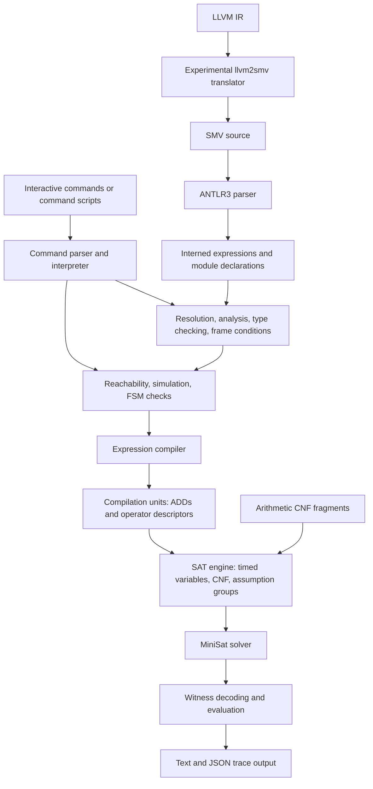
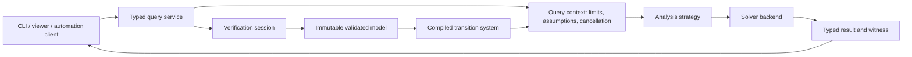

# yasmv: architecture, assessment, and development roadmap

Review baseline: commit `970f6484`, inspected on 2026-09-25.

Implementation update (2026-09-26): the first correctness milestone addresses
several findings below. See [current behavior and migration notes](docs/CORRECTNESS_BASELINE.md).
The review findings below retain their original baseline context.

SAT migration update (2026-09-28): the current engine uses pinned CaDiCaL 3.0.1,
not MiniSat. See [the backend guide](docs/CADICAL_BACKEND.md) and
[migration plan](cadical_integration.md). MiniSat references below describe the
historical review baseline, not current build requirements.

The accepted development direction is broken down into work packages and completion gates in the [implementation plan](docs/IMPLEMENTATION_PLAN.md).

This document describes the implementation in this checkout, distinguishes working capabilities from incomplete ones, and proposes an incremental development direction. Findings marked **observed** were exercised with the existing binaries; findings marked **inspection** come from source review. Proposed interfaces and features are designs, not existing commands.

## 1. Assessment and recommended direction

yasmv is a finite-state modeling and SAT-based analysis engine with an interactive shell. Its strongest existing assets are its expressive SMV dialect, guarded assignments with generated frame conditions, a reusable expression compiler, multiple reachability strategies, and concrete witness traces. The supplied planning examples demonstrate a useful product direction already present in the code.

The most promising direction is an **interactive model exploration and scenario generation workbench**: describe a system, ask whether a situation can happen, inspect the sequence that makes it happen, change assumptions, and generate executable test scenarios. Constraint explanations would make it useful when no scenario exists. This could serve protocol designers, developers of workflow engines, and teaching or planning applications.

That direction fits the current implementation particularly well: reachability provides scenarios; simulation provides exploration; traces provide the user interface data; assumptions provide controlled experiments. The LLVM translator offers a later route to a deliberately restricted software verification product, but currently requires substantial semantic work.

The first development milestone should establish trustworthy answers. This review reproduced a wrong answer with optional CNF simplification, a crash hidden by the short-test harness, and semantic diagnostics that do not fail model loading. New interfaces should follow those repairs.

## 2. System structure



This is a modular executable assembled from internal libraries. Directory boundaries are useful, but dependencies are not strictly layered: grammar actions access global managers; algorithms take a command object; semantic analysis invokes the compiler and SAT engine; the compiler and witnesses depend on global model and encoding state.

| Area | Responsibility and main navigation points |
| --- | --- |
| Startup and options | [main.cc](src/main.cc), [opts_mgr.cc](src/opts/opts_mgr.cc): manager initialization, command-line options, model load, shell loop, signal handling |
| Parsing | [smv.g](src/parser/grammars/smv.g), [parse.cc](src/parse.cc): model, expression, type, and shell grammars in one ANTLR3 grammar |
| Expressions | [expr.hh](src/expr/expr.hh), [expr_mgr.hh](src/expr/expr_mgr.hh), [walker](src/expr/walker/walker.hh): pooled expression nodes, canonicalization, traversal, printing, time expansion |
| Types and symbols | [type](src/type/classes.hh), [symbols](src/symb/classes.hh), [resolver](src/model/model_resolver.cc): type objects, declarations, module contexts, parameter resolution |
| Models | [model_mgr.cc](src/model/model_mgr.cc), [analyzer.cc](src/model/analyzer/analyzer.cc), [type checker](src/model/type_checker/type_checker.cc): semantic passes and generated transitions |
| Compilation | [compiler.cc](src/compiler/compiler.cc), [typedefs.hh](src/compiler/typedefs.hh): expressions to compilation units containing decision diagrams and deferred operator descriptions |
| Encoding | [enc.hh](src/enc/enc.hh), [enc_mgr.cc](src/enc/enc_mgr.cc): Boolean, integer, enumeration, and array encodings plus maps back to symbols |
| Decision diagrams | [CuddMgr](src/dd/cudd_mgr.hh), [vendored CUDD](src/dd/cudd-2.5.0/README): symbolic expression construction and manipulation |
| SAT | [engine.cc](src/sat/engine.cc), [cnf.cc](src/sat/cnf.cc), [inlining.cc](src/sat/inlining.cc): CNF generation, arithmetic fragments, incremental solving, model values |
| Analysis | [base.cc](src/algorithms/base.cc), [reach](src/algorithms/reach/reach.cc), [simulation](src/algorithms/sim/simulation.cc), [FSM](src/algorithms/fsm/fsm.hh) |
| Results | [witness.hh](src/witness/witness.hh), [witness manager](src/witness/witness_mgr.cc), [dump_trace.cc](src/cmd/commands/dump_trace.cc), [read_trace.cc](src/cmd/commands/read_trace.cc) |
| LLVM frontend | [llvm2smv_pass.cc](llvm2smv/src/llvm2smv_pass.cc), [expr_translator.cc](llvm2smv/src/expr_translator.cc), [smv_writer.cc](llvm2smv/src/smv_writer.cc): separate executable emitting SMV text |
| Build and verification | [Makefile.am](Makefile.am), [configure.ac](configure.ac), [CI](.github/workflows/ci.yml), [unit tests](src/test), [short tests](short-tests), [examples](examples) |

## 3. The model and compilation pipeline

### Language and semantics

The central model is a collection of modules containing variables, definitions, and `INIT`, `INVAR`, and `TRANS` constraints. Variables include Booleans, finite signed and unsigned integers, enumerations, arrays, and module instances. The language also supports nondeterministic expressions, conditional expressions, casts, `next`, and explicit time references.

For the ordinary state-only fragment, the mathematical model is:

- `I(s)`: admissible initial states.
- `V(s)`: constraints on every state.
- `T(s, s')`: the allowed transition relation.
- `G(s)`: a reachability target supplied by a query.

A bounded reachability query at depth `k` asks whether this formula is satisfiable:

```text
I(s0) ∧ V(s0)
∧ ∧[i=0..k-1] (T(si, si+1) ∧ V(si+1))
∧ G(sk)
```

Additional query constraints and the special treatment of input and frozen variables extend this picture. A satisfiable query produces a witness. An unsatisfiable query at one depth alone does not establish global unreachability.

`INVAR` constrains the model; it is not a property declaration that the checker proves from the unconstrained model. A future safety-property API must preserve this distinction: to check a property `P`, search for `!P` rather than adding `P` to the model's assumptions.

Guarded assignments are already implemented. With `#inertial`, an assignment such as `guard ?: x := expression` contributes a guarded next-state constraint. Analysis collects guards for assigned variables and adds preservation constraints when none applies. This gives users a concise way to describe actions. The implementation's error handling around overlapping guards needs repair, as described below.

### Parsing and analysis

The grammar constructs expressions and mutates the model through manager references. [ReadModel](src/cmd/commands/read_model.cc) parses a file and then invokes `ModelMgr::analyze()`.

The model manager performs successive passes to build module contexts, map actual parameters to formals, analyze expressions, and check types. It subsequently generates frame conditions. Guard exclusivity checks compile formulas and run SAT queries, so loading a model can perform nontrivial solving work before the first explicit query.

Expressions are pooled and shared. `Expr` is a tagged node with union storage for operands, atoms, or constants; pointer identity is used throughout caches and lookup maps. This makes canonicalization valuable, but also makes expression lifetime an architectural contract. Replacing raw pointers mechanically would not establish that contract.

A useful future split is a declaration model, a validated model, and a compiled transition system. These phases currently share mutable process-wide state, which complicates rollback after an unsuccessful load.

### Compilation and encoding

`Compiler::process()` performs five explicit stages:

1. Build variable encodings.
2. Compile expressions using decision diagrams.
3. Check internal compiler structures.
4. Activate conditional-selection multiplexers.
5. Activate array-selection multiplexers.

The result is a `compiler::Unit`: an expression reference, a vector of ADDs, arithmetic operator descriptors, and conditional/array selection descriptors. Arithmetic operations can therefore remain deferred until their CNF implementation is instantiated.

CUDD is primarily part of this expression compilation pipeline. The inspected reachability algorithms operate through SAT; the presence of CUDD does not establish a BDD fixed-point model-checking implementation.

Encoding terminology matters:

- Boolean encoding uses a single bit.
- Integer encoding tracks width, signedness, and bit/digit representations.
- Enumeration encoding uses the monolithic encoding machinery.
- Array encoding composes element encodings.
- **UCBI** means Untimed Canonical Bit Identifier: symbol expression, relative time, and bit index.
- **TCBI** means Timed Canonical Bit Identifier: a UCBI instantiated with a time base, with special handling for frozen and backward-time values.

UCBI and TCBI identify bits across time; they are not alternative solver backends. Their separation is a useful foundation for additional unrolling algorithms.

### CNF and arithmetic microcode

`Engine::push()` translates a unit into SAT clauses at a particular time and formula group. It emits CNF for decision diagrams, instantiates arithmetic fragments, and handles selectors. Each engine owns its MiniSat instance and timed-variable maps. Formula groups use assumption literals to activate or deactivate constraints between solver calls.

Arithmetic fragments are JSON files indexed by signedness, operation, and width. Startup registers loaders; fragment contents are loaded lazily under a mutex. The distribution covers widths up to 64 bits according to the packaged generator and README. The generator in [ucodegen.py](tools/ucodegen/ucodegen.py) uses Python 2 syntax, an absolute developer path, and a custom NuSMV invocation. Regenerating the trusted arithmetic encoding is consequently not a self-contained modern build step.

The microcode design deserves preservation as an experiment in reusable arithmetic circuits, accompanied by a reproducible generator, a versioned manifest, integrity checks, and semantic tests. It is part of the trusted computation path, not merely application data.

## 4. Algorithms, results, and current capability boundaries

### Reachability

[Reachability::process](src/algorithms/reach/reach.cc) compiles the target and query constraints, checks their time direction, then launches selected forward/backward and fast/ordinary strategies. Threads share the query object and publish status under a mutex, while maintaining separate SAT engines.

The ordinary strategies add pairwise state-uniqueness constraints and seek an unreachability proof when a longer simple path becomes infeasible. The fast strategies omit that proof search and focus on witness discovery. They can keep searching an unreachable cyclic model until another strategy proves the result or execution is interrupted.

Adding uniqueness constraints introduces quadratically many state pairs in the explored depth, before accounting for the encoded state width. This is a specific scaling pressure that motivates induction or property-directed methods later.

The portfolio returns the first published conclusive result. It does not provide a documented global minimum-length or minimum-cost guarantee. Mixed forward/backward time constraints are explicitly rejected. Cancellation currently interrupts all engines registered in a global manager.

### Other analyses

| Capability | Present behavior and boundary |
| --- | --- |
| `check-init` | Checks satisfiability of initial-state, invariant, and additional constraints; explicitly preserves solver UNKNOWN |
| `check-trans` | Looks for a transition path under invariants and supplied constraints for the configured length; does not establish that every reachable state has a successor |
| `diameter` | Searches for the longest feasible simple path under invariants, without asserting `INIT`; this is a recurrence-diameter style bound, not necessarily the maximum shortest distance from initial states |
| `pick-state` | Finds or enumerates admissible initial states; supports counting/limits, but needs explicit completeness/interruption reporting |
| `simulate` | Extends a selected trace under constraints, with step limits and an optional stopping condition |
| Witness management | Named traces, selection, duplication, expression evaluation, and text/JSON export |
| Trace import | Plain-text parser exists; JSON and YAML parser methods are stubs returning failure |
| Temporal verification | `next` and explicit time expressions exist; a general CTL/LTL property checker and fairness machinery were not found in the inspected implementation |
| Embedding | Internal libraries exist, but no clean session-oriented public API was found |
| LLVM translation | Produces parsable SMV for the tested input, but does not preserve that program's semantics |

### Witnesses and user experience

Witness extraction reverses bit encodings into named values and records time frames. Definitions can be evaluated for display, which is valuable for domain-specific views: users can see `GOAL`, a queue size, or a protocol phase instead of interpreting individual bits.

JSON export is already a practical starting point for a viewer. It contains trace IDs, descriptions, input assignments, and state/definition values by step. Before treating it as an interchange contract, add a schema version, model identity, explicit time coordinates, type/width metadata, and exact integer representations that survive clients with limited numeric precision.

### LLVM frontend maturity

The translator has a useful separation into type translation, expression translation, and output writing. Its current implementation nevertheless falls short of a semantic compiler:

- Basic-block branches are not encoded. The function program counter gets a generic transition to `EXIT`.
- PHI instructions are skipped.
- Arithmetic assignments execute without basic-block guards.
- Nonzero global initializers are omitted.
- Loads/stores use placeholder variable handling rather than a defined memory model.
- Signed and unsigned LLVM operations are mapped to the same operators while integer types default to unsigned.
- Unsupported instructions can be ignored, and unknown constants/types have fallback translations.

**Observed:** translating a small LLVM loop produced `x := 0` for a load from a global, left a global constant `10` unconstrained initially, and sent the program counter directly to exit. yasmv accepted the resulting model. Parsing the output is therefore insufficient evidence of translation correctness.

LLVM integers acquire signed interpretation from operations; PHI selection depends on the incoming control-flow edge. Poison and undefined behavior also require an explicit treatment. These contracts should guide any supported subset. See the official [LLVM language reference](https://llvm.org/docs/LangRef.html) and [undefined behavior manual](https://llvm.org/docs/UndefinedBehavior.html).

## 5. Findings that should shape development priorities

Priority P0 means address before increasing reliance on analysis results. P1 means address before embedding or broadening workflows. These are recommendations from this review, not implemented fixes.

### P0: optional CNF transformations can change answers

**Observed.** For this model:

```smv
MODULE main
VAR x : boolean;
INIT x && !x;
```

`check-init` reports inconsistency with default settings and consistency with `--cnf-blocked-clause yes`.

The custom [blocked-clause pass](src/sat/engine.cc) examines the pending clause batch. Removing clauses can preserve existential satisfiability in isolation while losing required behavior under assumption literals, previously committed clauses, later additions, or model reconstruction. In particular, groups are externally controlled variables, not freely existential choices.

The optional variable-elimination pass warrants the same scrutiny. **Inspection:** it appends resolvents to `f_pending_clauses` after sizing `clause_removed`, then indexes that removal vector up to the enlarged clause count. It also lacks a visible reconstruction contract for the removed variables. This is a separate indexing and semantic concern; this review did not reproduce that path dynamically.

Recommended action: quarantine transformations whose incremental and model-preservation contracts are unproven; protect all externally observable and assumption variables; repair indexing; test each transformation against the baseline over sequences of clause additions and changed assumptions. Verify returned assignments against the original formula. Tautology and duplicate removal should have their own evidence, independent of the more aggressive passes.

### P0: the short-test harness hides failures and crashes

**Observed.** [run-short-tests.sh](tools/run-short-tests.sh) compares text using `[[ $RES -eq "OK" ]]`. Bash interprets these operands arithmetically: in the reviewed environment, `KO` is accepted as `OK`. The pipeline also hides the model-checker's status behind `tail`.

All 43 active short cases were reported as passing. Direct execution found 42 cases ending in `OK` after whitespace trimming, and `relational/relational01.smv` terminating with SIGSEGV, reproduced a second time. Its root cause was not investigated in this architecture review.

Recommended action: use a literal text comparison with intentional whitespace normalization; check the checker exit status separately; make crashes/timeouts fatal; specify expected negative outcomes per case. Add a harness self-test in which a fake checker emits `KO`, crashes, or times out and must fail the run. The functional harness should also check process status in addition to output differences.

### P0: semantic validation does not reliably gate model publication

**Observed.** Two `TRUE` guards assigning opposite values to the same inertial Boolean produce an overlap diagnostic, but `last` reports successful model loading. [Analyzer::generate_framing_conditions](src/model/analyzer/analyzer.cc) collects and logs errors without returning failure or throwing. It also waits on futures without calling `get()`, so task exceptions are not retrieved there.

**Inspection:** model analysis marks `f_analyzed` true before generating frame conditions. Parsing mutates shared model state directly. These choices make failed-load recovery and validity guarantees unclear.

Recommended action: accumulate structured diagnostics, retrieve worker exceptions, and publish a validated model only after every phase succeeds. Preserve the preceding model if a replacement fails. Decide explicitly whether guard exclusivity is required over all valuations or only those satisfying invariants: current checks omit invariants and therefore can reject guards that overlap only outside valid states once rejection is enforced.

### P0: UNKNOWN must remain inconclusive

**Inspection.** [CheckTransConsistency::process](src/algorithms/fsm/trans.cc) handles UNSAT but falls through to `FSM_CONSISTENCY_OK` when its status remains undecided, including after UNKNOWN. Enumeration also stops for any non-SAT solver result without exposing whether the count is complete.

Recommended action: use exhaustive status handling, preserve cancellation/budget exhaustion, and attach a completeness flag to enumeration. Test an injected UNKNOWN result at each algorithm boundary. A command returning a Boolean success value cannot adequately represent these outcomes.

### P1: model identity and lifecycle need explicit ownership

**Inspection.** [Model::main_module](src/model/model.cc) returns `begin()` of an unordered module map. Root selection is therefore tied to container iteration rather than an explicit root-module contract. Symbol indexing also contains a top-level-only assumption.

Managers are mostly process-lifetime singletons. `Model::~Model()` contains `assert(false)` and a symbol-cleanup TODO; several encoding destructors also assert. The shell contains documented allocation leaks. This architecture works best with one process representing one model lifetime; it does not yet support reliable model replacement or many independent sessions.

Recommended action: introduce explicit root selection, model revision IDs, clear owners for declarations and traces, and a lifetime boundary for interned expressions and encodings. Repair destructors before introducing normal session destruction. Test repeated model load/failure/destruction and module declaration reordering.

### P1: batch execution needs a reliable result contract

**Observed.** An invalid model input followed by `quit` exited with code zero. [Interpreter](src/cmd/interpreter.cc) stores errors in its last-result variant; that does not automatically become a nonzero process exit. End of input replaces the last result with success.

Recommended action: separate command execution status from query outcome, define batch exit conventions, and make a failed required command fail a batch. Keep diagnostic streams separate from serialized results. Define what cancellation, a disproved property, malformed input, and an internal error mean to CI independently.

### P1: concurrency is broader than its ownership boundaries

**Inspection.** Compiler calls are protected by a compiler-instance mutex, while expression, encoding, CUDD, witness, and engine managers are shared. The engine registry has locking, but this does not by itself establish thread safety for all objects reached through a query. Cancellation is global to the process.

[The signal handler](src/main.cc) performs stream output, clock calls, manager access, and mutex-taking operations. Signal handling should instead record a request through a signal-safe mechanism and let ordinary execution perform reporting or cancellation.

Recommended action: freeze compilation results before worker launch, give a query ownership of its workers/engines, return local results to a coordinator, and validate shared reads and cache writes with targeted race detection. An interrupted query must not cancel an unrelated one. Until session isolation exists, separate processes are a practical boundary for concurrent jobs.

## 6. A graceful evolution of the architecture

Preserve the grammar, expression compiler, timed-bit mapping, and working algorithms while making their contracts explicit. A complete rewrite or build-system migration is not a prerequisite.



| Proposed boundary | Contract and incremental introduction |
| --- | --- |
| `VerificationSession` | Owns a model revision, environment, traces, and compilation state. Start by routing current manager access through one explicit session; remove globals progressively. |
| `ValidatedModel` | A successfully resolved and typed model with explicit root, source locations, and generated constraints. A failed load cannot become this type. |
| `CompiledTransitionSystem` | Reusable initial, invariant, and transition units tied to a model revision and relevant compilation options. Start with the units currently held by `Algorithm`. |
| `QueryContext` | Owns per-query assumptions, deadline/depth/conflict limits, cancellation, and worker coordination. |
| `SolverBackend` | Clause addition, assumptions, three-valued solving, model values, interruption, and optional failed-assumption/proof capabilities. Start with a MiniSat adapter behind the current `Engine`. |
| `QueryResult` | Carries outcome, reason, explored bound, strategy, statistics, model revision, and optional witness/proof. Shell text is a rendering of this object. |
| `Trace` | Typed, serializable data tied to the model that produced it; transformations and replay checks are explicit operations. |

For a reachability query, useful outcomes are `reachable`, `unreachable`, `unknown`, and `error`. `unknown` should carry reasons such as depth limit, timeout, cancellation, or solver budget. For a property query, use `proved` and `disproved` only with their defined proof obligations. A bounded negative result should state its bound.

`Algorithm` currently compiles model constraints in its constructor and stores a command reference. First extract query configuration and results from the shell, then share compiled units across queries. Cache keys must include model revision, widths/encoding settings, generated frame constraints, and environment values that affect compilation.

An IPASIR-style adapter is a useful reference for the backend boundary: its interface covers incremental clauses, assumptions, model values, failed assumptions, and termination callbacks. Backend capabilities should be explicit; proof logging and preprocessing controls are additional contracts. See the [IPASIR interface](https://github.com/biotomas/ipasir/blob/master/ipasir.h).

## 7. New functionality with the best architectural fit

### 7.1 Interactive trace exploration and branching — first product milestone

**User value:** load a model, find a scenario, scrub through states, watch derived expressions, duplicate a trace, and explore an alternative next step. Existing maze and puzzle models make immediate demonstrations; a retry protocol or job scheduler gives a practical application.

**Existing foundation:** simulation, trace selection/duplication, witness evaluation, and JSON export.

**Add:** a versioned JSON protocol, trace validation/import, explicit step coordinates, and a small viewer. Begin with a subprocess running a single model and a viewer consuming exported artifacts; move to long-lived sessions after lifecycle work. Keep original and branched traces separate.

**Acceptance:** the same trace survives export/import with its types and values intact; every branch satisfies the transition relation; constraints explaining a blocked step are visible. Large integers must survive serialization exactly.

**Effort:** moderate after result-contract repairs. This makes existing functionality accessible without requiring a new verification algorithm.

### 7.2 Explain inconsistent constraints and impossible steps

**User value:** answer “Which assumptions prevent this move?” or “Why are there no initial states?” with named source constraints.

**Existing foundation:** solver assumptions, query constraints, compiler units, and semantic analysis already invoking SAT.

**Add:** stable IDs and source spans for constraints; selector literals attached to complete high-level constraints; failed-assumption extraction; optional core shrinking. Explain generated frame constraints in terms of their source assignments. Shared arithmetic definitions should remain valid when selected constraints are disabled.

**Acceptance:** the reported subset is itself inconsistent; a requested minimal explanation passes a deletion check. A core is generally not minimal without further work. An UNSAT core for depth `k` explains that bounded query, not global unreachability.

**Effort:** moderate. Source provenance needs to survive interning and lowering: attach occurrence information to declarations/constraint records rather than assuming one source location per shared expression node.

### 7.3 Goal-directed scenario and test generation

**User value:** generate a sequence that reaches a rare protocol state, exercises a recovery branch, or covers a workflow transition, then export it for replay against an implementation.

**Existing foundation:** `reach`, additional timed constraints, witness values, and simulation.

**Add:** named actions and coverage goals, a mapping from model actions to external test steps, coverage reports, and replay adapters. Separate controllable inputs from state observations and environmental choices in the model contract.

**Acceptance:** replayed tests reach the requested goal; coverage refers to declared model transitions; divergence from the real implementation is reported at the first mismatching observation. Witness replay must check initial, invariant, transition, and query constraints.

**Effort:** moderate for a chosen domain. A generated witness is one possible execution. A policy guaranteed to succeed against every environmental choice would require game/synthesis semantics and is a separate capability.

### 7.4 Shortest plans, then cost-aware plans

**User value:** find the shortest sequence of actions, then optionally optimize energy, retries, or a domain-specific cost.

**Existing foundation:** increasing-depth reachability, arithmetic state variables, and targets.

**Add:** a bounded query API and an explicit optimality policy. For shortest plans, retain evidence that every smaller depth was completely checked and UNSAT before claiming minimality. A portfolio race alone does not provide that evidence.

For costs, start with an explicit finite horizon and a bounded accumulated-cost expression, tightening its bound through SAT queries. Prevent modular arithmetic overflow and define allowable costs. A globally optimal unbounded plan needs a completeness argument beyond finding a cheap bounded witness.

**Acceptance:** match exhaustive shortest/cost results on small graphs, including ties and zero-cost actions; record whether a result is feasible or certified optimal.

**Effort:** modest to moderate for shortest paths; higher for cost optimization.

### 7.5 Named safety properties and induction

**User value:** check “a completed job is never executed again” or “both protocol peers never own the token,” with a reproducible result and counterexample.

**Existing foundation:** target reachability, reusable transition unrolling, and SAT assumptions.

**Add:** property declarations separate from assumptions, bounded safety checking, then k-induction. The base case searches for reachable violations; the inductive step checks preservation over arbitrary admissible predecessor states. Failure of induction is inconclusive, not necessarily a reachable counterexample.

Later add IC3/PDR as an additional strategy after introducing clause/frame management, generalization, and state-cube queries. It can prove safety without building progressively longer transition unrollings, but requires substantial algorithmic work and does not guarantee improvement on every model. See Bradley's [SAT-Based Model Checking Without Unrolling](https://theory.stanford.edu/~arbrad/papers/IC3.pdf).

**Acceptance:** independently replay counterexamples; validate candidate inductive invariants against initialization, consecution, and the property. Compare tiny models with exhaustive exploration.

**Effort:** moderate for a property API and k-induction; high for IC3/PDR.

### 7.6 A trustworthy restricted LLVM frontend

**User value:** analyze a small, precisely documented subset of integer programs and return traces tied to source locations.

**Existing foundation:** LLVM parsing, an SMV output object model, and the core bit-vector machinery.

**Add in order:** reject unsupported constructs; select one entry function; implement control-flow edges and predecessor-aware PHIs; preserve signed operation semantics and widths; encode initialization; define assertions and error states; retain debug locations. Start with scalar SSA and either reject memory or support narrowly defined non-escaping storage.

Choose the transition granularity explicitly. One instruction per model step is simple to explain; one basic block per step needs symbolic substitution so intra-block data dependencies use newly computed values correctly. Decide how termination stutters and how undefined behavior is represented or excluded. Function calls, aliasing, and heap allocation should follow a verified subset.

**Acceptance:** differential execution over small input domains, branch/loop/PHI tests, and verification of known true and false properties. Every unsupported operation must stop translation with a diagnostic rather than silently changing its meaning.

**Effort:** high. This is a separate development track once the core's correctness gates are in place.

### 7.7 Performance features that preserve the model contract

Before adding a second symbolic backend, measure loading, frame analysis, compilation, CNF generation, solving, and witness extraction separately. Record wall time, peak memory, clauses/variables, depth, strategy, and solver configuration for each benchmark.

Promising targeted changes are compiled-model reuse, cancellation-aware bounded worker pools, guard-pair compilation reuse, and cone-of-influence reduction. Dependency slicing must retain constraints that can affect the property through transitions or shared assumptions; a syntactic variable filter alone is insufficient. Validate reductions against unreduced small models and reconstruct complete witnesses where required.

An SMT backend could eventually help arithmetic-heavy models, but the current unit representation is already tied to decision diagrams and arithmetic CNF descriptors. Introduce a typed transition-system representation before that lowering if backend diversity becomes a demonstrated need.

General LTL/fairness support, controller synthesis, unrestricted C verification, and probabilistic models each require substantial new semantics. They should be separate proposals with clear users and proof obligations.

## 8. Delivery sequence and completion gates

| Stage | Concrete deliverable | Completion gate |
| --- | --- | --- |
| A — trustworthy baseline | Repair harness, investigate the reproduced crash, quarantine unsound CNF passes, reject invalid models, preserve UNKNOWN, fix batch errors | Known negative models fail correctly; crash/timeout injection fails CI; optimization results and witnesses agree with the baseline |
| B — usable model service | Explicit root/model revisions, structured diagnostics and results, query limits/cancellation, versioned traces | Repeated successful/failed loads behave predictably; trace round trips and replay pass; interrupted queries remain inconclusive |
| C — compelling demonstration | Trace viewer, branch exploration, named goals, bounded explanations, one scenario-export adapter | A user can inspect a protocol failure, change an assumption, generate an alternative trace, and replay it |
| D — stronger analysis | Reusable compilation, shortest plans, named properties and k-induction; benchmark-guided reductions | Optimality/proof claims have explicit evidence; small-model exhaustive comparisons pass; measured workloads improve |
| E — selected expansion | IC3/PDR or restricted LLVM verification according to actual demand | New semantics documented and independently checked against suitable oracles |

A coherent demonstration would be a retrying job-delivery protocol: specify loss and retry behavior, search for duplicate execution, inspect the counterexample, add a deduplication rule, rerun the property, and export the failure trace as an integration test. Each step builds on the same model and trace infrastructure. This is a proposed example, not a model already included in the repository.

The first few changes should be independently reviewable: repair the harness and preserve the crash as a regression; fix result/validation propagation; repair or disable unsafe optional simplification; define the serialized result contract; then build the first viewer workflow.

## 9. Build, maintenance, and validation strategy

The build uses Autotools and internal libtool libraries. `setup.sh` requests C++20, optimization, and strict warnings. CUDD 2.5.0 is vendored; MiniSat, ANTLR3, Boost, JsonCpp, and readline are used through the build. LLVM is configurable but **enabled by default** in [m4/llvm.m4](m4/llvm.m4), so a core-only build must explicitly disable it when LLVM is unavailable.

The CI workflow targets Ubuntu 24.04 and invokes `make test`. Several README dependency instructions refer to much older distributions. The LLVM test target translates an example and reports successful output generation; it does not establish behavioral equivalence.

Recommended maintenance work:

- Document a tested toolchain and the core-only build path. Exercise LLVM-enabled and LLVM-disabled configurations explicitly.
- Make arithmetic fragment generation reproducible and testable; remove absolute developer paths and obsolete script dependencies.
- Add ASan/UBSan coverage for parser/compiler/encoding and lifecycle tests; use targeted race checks for shared concurrent paths.
- Move timing and solver statistics into structured results so performance regressions can be compared without parsing logs.
- Keep example output snapshots for presentation checks, and assert semantic outcomes separately from formatting or nondeterministic witness choice.
- Update the language and command reference from tested examples. Historical TODO items such as guarded assignments are partly implemented and should not be treated as a current feature inventory.

High-value semantic tests include exhaustive arithmetic at small widths, signed boundaries, arrays and indices, absent/overlapping guards, multiple modules, cancellation/UNKNOWN, incremental assumption changes, and every returned witness satisfying the original constraints. Larger widths can use randomized differential checks. These tests exercise the trusted pipeline rather than duplicating implementation details.

A small explicit-state evaluator is a useful independent oracle for finite toy models. It can validate reachability, shortest paths, state counting, and recurrence bounds. It should implement the specified semantics independently, so it does not inherit the same compiler bugs.

## 10. Evidence and reproducibility

The review inspected first-party implementation paths and ran existing executables. It did not perform a clean rebuild, audit all vendored CUDD/MiniSat code, prove algorithm correctness, or run a performance benchmark campaign. Source findings and runtime observations are intentionally distinguished.

| Check performed | Result |
| --- | --- |
| Existing `yasmv_tests` executable | 32/32 test cases and 437/437 assertions passed |
| Existing functional harness | 13/13 example runs matched expected output |
| Existing short-test harness | Reported all 43 active cases passing; result is unreliable because of its comparison/status bugs |
| Direct short-case execution | 42 ended with `OK` after trimming; `relational01.smv` exited on SIGSEGV, confirmed again |
| Contradictory INIT, default solver options | Correctly reported inconsistent |
| Same INIT with blocked-clause elimination | Incorrectly reported consistent |
| Overlapping inertial assignment guards | Diagnostic emitted; load still reported success |
| Invalid model followed by `quit` | Process exit code 0 |
| Small LLVM loop translated to SMV | Output parsed, but lost control flow, a global load, and nonzero initialization semantics |

Existing baseline commands, run from the repository root:

```bash
YASMV_HOME="$PWD" ./yasmv_tests --report_level=short --log_level=error
YASMV_HOME="$PWD" bash tools/run-functional-tests.sh
YASMV_HOME="$PWD" bash tools/run-short-tests.sh
```

Reproduce the hidden crash directly, without the harness pipeline:

```bash
YASMV_HOME="$PWD" ./yasmv --quiet short-tests/relational/relational01.smv \
  < short-tests/unfeasible-pick-state.cmd
```

Save the contradictory Boolean model from section 5 as `/tmp/yasmv-contradiction.smv`, then run:

```bash
YASMV_HOME="$PWD" ./yasmv --quiet /tmp/yasmv-contradiction.smv <<'COMMANDS'
check-init
quit
COMMANDS

YASMV_HOME="$PWD" ./yasmv --quiet --cnf-blocked-clause yes \
  /tmp/yasmv-contradiction.smv <<'COMMANDS'
check-init
quit
COMMANDS
```

For the overlapping-guard observation, use:

```smv
MODULE main
#inertial
VAR x : boolean;
INIT !x;
TRANS TRUE ?: x := TRUE;
TRANS TRUE ?: x := FALSE;
```

After loading it, `last` reports success despite the overlap diagnostic; `check-trans` reports inconsistency.

## 11. Where to extend the code

| Intended change | Entry points and required integration |
| --- | --- |
| Add a query/command | Command class, [command manager](src/cmd/commands/commands.cc), [grammar](src/parser/grammars/smv.g), build lists, help, and result handling |
| Add an analysis strategy | [Algorithm base](src/algorithms/base.hh), query coordinator, solver status/cancellation handling, witness construction, and semantic oracle tests |
| Add a language operator | Grammar, expression tag/factory, walkers, printer, analyzer/type checker, compiler, evaluator, and encoding/microcode if needed |
| Add trace tooling | [Witness](src/witness/witness.hh), [evaluator](src/witness/evaluator.cc), serialization/import commands, and trace replay validation |
| Add an arithmetic implementation | Compiler descriptors, [microcode loader/inliner](src/sat/inlining.cc), generator, and cross-width semantic tests |
| Add a frontend | Validated model/transition-system contract; initially SMV emission with parse and behavioral checks |
| Add another solver | SAT engine/backend boundary, assumptions, protected variables, model reconstruction, cancellation, and capability reporting |

The highest-value architectural investment is a reliable contract from source model to query result and replayable trace. That contract allows the existing solver machinery to support an engaging exploration tool, a practical scenario generator, and progressively stronger verification methods.
