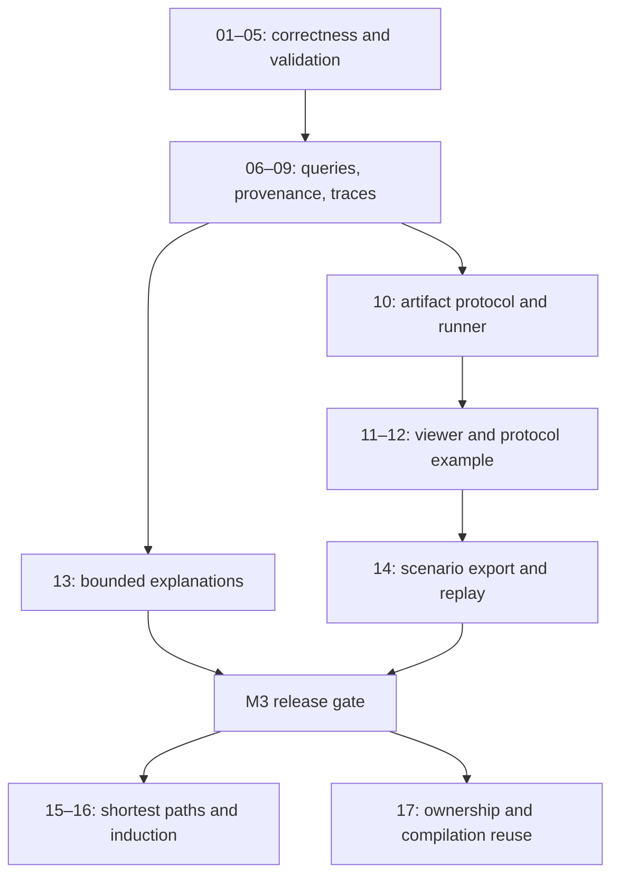

# Implementation plan: model exploration and scenario generation

Status: M0 (packages 01–05), M1 (packages 06–09), and M2 (packages 10–12)
are implemented and locally verified on 2026-09-26. M3–M4 remain planned. Current behavior, API usage, migration
notes, and acceptance evidence are documented in
[CORRECTNESS_BASELINE.md](CORRECTNESS_BASELINE.md),
[QUERY_AND_TRACE_CONTRACTS.md](QUERY_AND_TRACE_CONTRACTS.md), and
[WORKBENCH.md](WORKBENCH.md).

Prepared 2026-09-26 against commit `2077efeb`. The accepted direction and evidence are in [ARCHITECTURE.md](../ARCHITECTURE.md). The findings below describe the original planning baseline; the correctness baseline document records the implemented repairs and their verification.

## 1. Intended outcome

Deliver a local workbench in which a developer can:

1. Load a finite-state model and see actionable validation diagnostics.
2. Ask whether a named goal or failure state is reachable within explicit limits.
3. Inspect a validated witness as a timeline, including derived expressions.
4. Branch from a selected state under an additional constraint.
5. Explain inconsistent initial constraints or an impossible bounded continuation.
6. Export an action sequence and replay it against a small implementation.

The first complete demonstration will model a retrying job-delivery protocol. It will find duplicate execution, display the trace, replay it against a deliberately faulty implementation, and compare the behavior after deduplication. A negative bounded search will be labeled with its bound; an unbounded safety claim will require the later proof milestone.

### Scope and working decisions

- Target the existing Linux/CLI environment and a local browser interface first.
- Retain the current SMV dialect, C++ core, MiniSat integration, and Autotools build.
- Use one fresh checker process per analysis job for the first workbench release. Store model revisions, query specifications, and traces as artifacts outside that process.
- Introduce typed service boundaries inside the executable before introducing a persistent in-process session API.
- Use the existing JSON dependency for interchange. Select any additional UI/server dependencies when implementing the workbench, after checking maintenance and packaging requirements.
- Keep the LLVM translator explicitly experimental. Its semantic repair is a later workstream with separate acceptance criteria.
- Preserve `#input` as the existing compilation-time environment substitution. Model per-step actions through explicit ordinary variables and constraints, plus scenario metadata.

These choices let the first product use the core without making full singleton removal a prerequisite. Every stage below has an independent completion gate.

## 2. Milestones and dependencies

| Milestone | Deliverable | Work packages | Exit condition |
| --- | --- | --- | --- |
| M0: trustworthy execution | Correct result propagation, reliable tests, valid-model gate, supported encoding baseline | 01–05 | Known failures are detected; the reproduced crash is fixed; supported configurations pass semantic regressions |
| M1: query and trace contracts | Typed requests/results, bounded jobs, diagnostics, exact trace interchange and replay | 06–09 | An external client can distinguish outcomes and validate every displayed witness |
| M2: first workbench | Artifact protocol, local runner, timeline, branching, protocol example | 10–12 | The complete load/search/inspect/branch workflow works without interpreting console output |
| M3: useful developer workflow | Bounded explanations and executable scenario export | 13–14 | The protocol failure can be explained and replayed against an implementation |
| M4: stronger analysis | Shortest witnesses, named properties, induction, reusable sessions | 15–17 | Optimality/proof claims are validated; reuse preserves results and isolates jobs |

Packages are proposed review units, not a requirement for one commit each. Investigation-heavy packages can be split into a regression and a fix in the same mergeable series. Size labels are relative: **S** is focused, **M** crosses several components, and **L** contains material investigation or new infrastructure. Calendar estimates should follow M0, because the crash and lifecycle issues have unknown depth.

## 3. M0 — establish trustworthy execution

### 01. Establish the supported CNF configuration — S

**Touch:** `src/sat/engine.cc`, `src/sat/engine.hh`, `src/opts/opts_mgr.*`, solver option documentation, SAT regression tests.

Reject requests for the custom blocked-clause and variable-elimination passes with a clear unsupported-option diagnostic until their incremental semantics and model reconstruction are validated. Keep the flags recognizable so scripts fail explicitly. Audit the other enabled transformations individually; retain only transformations with evidence that they preserve assumptions, previously committed clauses, future additions, and observable model values.

Retain the contradictory-INIT reproduction as a regression. Test repeated solves with changed assumption polarities and later clauses, including SAT-to-UNSAT transitions. Validate any returned assignment against the original clauses. Document conditions required before a quarantined pass can return: protected variables, reconstruction, incremental tests, and sanitizer-clean indexing.

**Gate:** no supported flag combination turns the known contradictory model into a satisfiable one; quarantined flags fail before solving. **Dependencies:** none.

### 02. Repair test execution and fix the hidden crash — L

**Touch:** `tools/run-short-tests.sh`, `tools/run-functional-tests.sh`, test build targets, `short-tests/relational/relational01.smv`, and the source implicated by debugging.

Capture checker status separately from output; compare normalized result strings literally; enforce timeouts; preserve diagnostics. Specify expected parse/type errors separately from legitimate UNSAT results. Add harness tests using a fake checker that emits `KO`, exits nonzero, crashes, or times out. A case must satisfy both its expected semantic result and its expected process status.

Build the relational crash with debugging and sanitizers, reduce the input, identify the fault, and repair the responsible compiler/type/encoding path. Keep both the reduced case and the original case. Do not solve the failing gate by removing the case or labeling a crash as an expected semantic error.

**Gate:** every active short test is actually executed and classified; the original crash completes correctly; harness failure injection reliably fails CI. Merge the harness correction and required regression fixes as a green series. **Dependencies:** 01 for the supported solver baseline.

### 03. Preserve inconclusive results and batch failures — M

**Touch:** `src/algorithms/fsm/trans.cc`, `src/algorithms/sim/simulation.*`, reachability status handling, `src/cmd/interpreter.*`, command classes, `src/main.cc`.

Handle SAT, UNSAT, and UNKNOWN exhaustively. Return enumeration count with completeness and stop reason. Define behavior for zero/invalid limits. Track command execution errors independently of query outcomes so EOF or `quit` cannot erase a failed required operation.

Add a narrow solver-result injection seam for deterministic interruption/UNKNOWN tests. Preserve legacy interactive success/failure rendering where meaningful, while adding an explicit inconclusive path. A legitimate negative query is a completed computation; malformed input and internal errors are execution failures.

**Gate:** UNKNOWN never produces success, proof, or a complete count; invalid input causes batch failure; existing command scripts retain documented meaning. **Dependencies:** 02.

### 04. Make validation a prerequisite for analysis — M

**Touch:** `src/model/model_mgr.*`, `src/model/analyzer/analyzer.*`, `src/cmd/commands/read_model.cc`, command prerequisites, parser error propagation.

Retrieve asynchronous exceptions with `future.get()`, propagate guard conflicts, and make failed validation prevent every analysis command. Distinguish internal compiler/type readiness from public model validity: frame checking itself needs compilation, so simply moving the current `f_analyzed` flag is insufficient.

Initially retain the current conservative guard rule: guards assigning the same inertial variable must be exclusive across all admissible typed valuations, without relying on model invariants. Document it and add a case illustrating overlap only outside invariants. Reconsider invariant-relative acceptance as a separate semantic change.

For the existing singleton shell, invalidate and refuse reuse of a failed load; reject model replacement if clean rollback cannot yet be guaranteed. The workbench will preserve prior revisions by using fresh processes. Full in-process rollback arrives in package 17.

**Gate:** overlapping guards, parser/type errors, and worker exceptions fail loading and cannot leave a queryable invalid model. **Dependencies:** 03.

### 05. Stabilize root selection and the baseline build — M

**Touch:** `src/model/model.*`, model/options/grammar interfaces, symbol resolution, `Makefile.am`, `.github/workflows/ci.yml`, build and language documentation.

Replace unordered-map root selection with a stored root identity. Automatically select the sole module. For multi-module models require an explicit root and provide a migration diagnostic; inventory existing multi-module examples and update their invocations. Ensure declaration reordering does not change the chosen model.

Create CI configurations for core-only and LLVM-enabled builds, label LLVM checks as translation smoke tests, and add a focused ASan/UBSan job. Establish a self-contained default build/test recipe and archive the exact compiler/solver/microcode versions used by semantic tests. Record an inventory and digest of the arithmetic fragments; full generator modernization is tracked under follow-on work.

**Gate:** clean builds exercise the corrected harness; root selection is deterministic; module tests and known arithmetic edge cases have explicit expected outcomes. **Dependencies:** 02–04.

## 4. M1 — define query, diagnostic, and trace contracts

**Completed.** The CLI now uses typed query services. Machine jobs expose bounded
results, query-scoped cancellation, source provenance, exact trace v1 artifacts,
and replay validation. The isolated deadline runner is the M1 primitive for
package 07; the event protocol, artifact store, and browser workflow in M2 remain
next. Normal and ASan/UBSan acceptance checks passed; see the contract guide for
commands, counts, and the tested toolchain.

### 06. Extract typed query services — M

**Touch:** proposed `src/query/`, `src/algorithms/base.*`, existing command implementations, build lists.

Introduce `QuerySpec`, `QueryResult`, `QueryLimits`, and `QueryContext`. Remove the shell command dependency from the algorithm interface; make the CLI a caller and renderer of the query service. Continue using current compilation internally.

The result contract includes:

| Field | Meaning |
| --- | --- |
| Execution status | Completed, unknown, or error |
| Outcome | Query-specific SAT/UNSAT, reachable/unreachable, or later proved/disproved; only present when established |
| Scope | Exact depth, all depths through a bound, or an unbounded result with an identified proof method |
| Stop reason | Deadline, depth limit, conflict budget, user cancellation, validation failure, or internal error |
| Identity | Request ID, model revision, root, effective input bindings and options, engine and microcode version |
| Evidence | Optional trace, explanation, or proof artifact; explored bounds and completeness |
| Statistics | Compile/encode/solve/decode timings, variables/clauses where available, and selected strategy |

Separate execution from expectation checking. Machine jobs return 0 for completed outcomes, 2 for invalid requests/models, 3 for inconclusive/cancelled jobs, and 4 for internal errors. An expectation-checking CLI mode may return 1 when a completed outcome contradicts the requested expectation. Ordinary interactive `quit` retains its documented behavior.

**Gate:** commands and direct query calls agree; serialization needs no console-text interpretation; every outcome is covered by a contract test. **Dependencies:** M0.

### 07. Enforce query bounds and cancellation — M

**Touch:** `src/query/`, reachability strategies, `src/sat/engine_mgr.*`, `src/sat/engine.*`, signal handling.

Add depth, wall-clock, and solver-work limits. Check cancellation during loading/compilation/encoding where practical as well as inside solving. Register engines with a query, coordinate worker completion, and publish one final result after safely joining workers. Replace work in the signal handler with a signal-safe notification handled by ordinary code.

The first runner isolates jobs in separate processes and enforces a hard deadline if cooperative cancellation stalls. It reports forced termination as incomplete and discards partial final artifacts. Within one job, use a conservative strategy configuration until concurrency tests support the broader portfolio.

Record every fully checked depth. Reaching a depth bound without a witness gives a bounded negative result and an unknown unbounded outcome. Reject incompatible time constraints and empty strategy configurations as validation errors.

**Gate:** cancellation during solving and encoding terminates predictably, does not affect a second job, and never emits a conclusive result without its evidence. **Dependencies:** 06.

### 08. Preserve constraint identities and source provenance — M

**Touch:** `src/parser/grammars/smv.g`, `src/parse.*`, module constraint storage, semantic lowering, compiler units; proposed source/diagnostic records.

Attach stable constraint IDs and source spans to declaration occurrences. Preserve parentage through parameter expansion and generated frame conditions. Keep provenance outside interned expression identity, because identical expressions may occur at multiple source locations.

Define diagnostics with severity, code, primary span, related spans, and a plain-language message. Give synthesized constraints a source explanation rather than an invented source line. IDs are stable within a model revision; comparisons across changed revisions require explicit mapping.

**Gate:** two identical constraints at different locations are independently identifiable; a conflicting pair points to both assignments; a generated preservation constraint points back to its relevant declaration/guards. **Dependencies:** 04, 06.

### 09. Version trace interchange and implement replay validation — L

**Touch:** `src/witness/`, `src/cmd/commands/read_trace.*`, `dump_trace.*`; proposed `docs/formats/trace-v1.schema.json` and format documentation.

Define trace v1 with model revision, initial time, explicit step numbers, typed symbol declarations, values, query assumptions, and branch parent/prefix metadata. Encode integers with width, signedness, and an exact string representation. Distinguish absent/unassigned values from zero. Normalize backward witnesses into chronological display coordinates while preserving their origin.

Implement JSON import with strict schema/type/range checks. Validate traces against initialization, invariants, transitions, and the generating query. Reuse a fresh solver for whole-trace consistency; supplement it with an independent evaluator for the small supported Boolean/integer oracle subset. Report mismatch locations or inconclusive validation rather than silently repairing values.

**Gate:** export/import preserves signed boundaries, arrays, enums, and large values exactly; modified or wrong-model traces fail; both forward and backward witnesses replay; branches preserve their declared prefix. **Dependencies:** 06–08.

## 5. M2 — deliver the exploration workbench

### 10. Add an artifact protocol and local job runner — M

**Touch:** machine mode in `src/main.cc`, `src/query/`, proposed `docs/formats/`, `tools/workbench/`, packaging and usage docs.

Accept one structured request per checker job; emit JSON Lines events with `started`, `progress`, and one `result`. Keep diagnostics/logging off the machine-output stream. Introduce protocol version and explicit capability reporting. Reject unsupported major versions and malformed requests before solving.

Use a fresh worker per request. A logical workbench session owns immutable source/configuration artifacts and validated traces, independently of the worker's globals. Editing source or changing compilation-time input bindings creates a new revision. Query-only assumptions belong to the request; they do not mutate another query.

Support load/validate, initial-state selection, bounded reachability, trace validation, and constrained continuation first. Persist final artifacts atomically, attach request IDs, and handle worker crashes as errors. Launch subprocesses with structured arguments and a controlled working directory. Keep the service local by default.

**Gate:** two simultaneous jobs cannot exchange model/trace state; a crashed worker leaves the prior saved revision usable; all operations work through the documented protocol. **Dependencies:** 06–09.

### 11. Build the timeline and branch workflow — L

**Touch:** proposed `workbench/` UI assets, local runner, end-to-end fixtures.

Provide model selection, validation diagnostics, named goal entry, explicit limits, progress/cancellation, a state timeline, watched definitions, changed-value highlighting, and trace export. Display bounded/inconclusive results explicitly. Mark imported traces until replay validation succeeds.

Branching selects a prefix and adds a continuation constraint. Validate the prefix, pin all specified prefix states/choices, solve the extension, and return a new trace with a parent link. Editing an assumption that invalidates the prefix requires a new search from initialization, with an explanation of the conflict.

**Gate:** a user can load an existing example, search, inspect, branch, cancel, reload saved artifacts, and compare branches. The original trace remains reproducible after branching. **Dependencies:** 10.

### 12. Add the protocol demonstration and action metadata — M

**Touch:** proposed `examples/retry-protocol/`, workbench example catalog, scenario metadata schema.

Create a small bounded retry/delivery model, faulty and deduplicating variants, named goals, and a separately implemented toy runner. Define action labels and argument mappings in a sidecar scenario description before adding language syntax. Use explicit action variables for send/deliver/drop/retry choices; distinguish controllable choices from observed state.

Keep counters and identifiers sufficiently small for exhaustive checking. Define message loss, terminal stuttering, and retry bounds explicitly. Validate the example's expected state graph independently and record the expected duplicate-execution scenario.

**Gate:** faulty behavior produces a replay-valid counterexample; the corrected model has no counterexample through the declared bound; the UI shows the difference and the exact scope of each result. **Dependencies:** 09–11.

## 6. M3 — add explanations and executable scenarios

### 13. Explain inconsistent initial states and bounded continuations — L

**Touch:** solver assumption API, constraint provenance, compiler emission boundaries, query results, workbench diagnostics.

Expose failed assumptions through the current MiniSat adapter and gate complete high-level constraints using selectors. Keep shared definitional arithmetic clauses sound under selector changes. Account for model invariants, frame constraints, pinned trace values, and user assumptions in the explanation.

Start with initial-state inconsistency and single-step continuation; extend to bounded reachability after those tests pass. Return an unsatisfiable subset with source references. Offer deletion-based subset minimization under a separate budget. If shrinking stops early, retain a valid core and label it nonminimal. If the query cannot be decided, return unknown rather than an explanation of impossibility.

**Gate:** reasserting the reported constraints reproduces UNSAT; requested subset-minimal cores pass deletion checks; shared-expression and disabled-selector cases preserve meaning. The UI identifies the bound and fixed background assumptions. **Dependencies:** 07–10; UI integration after 11.

### 14. Export and replay executable scenarios — L

**Touch:** scenario schema, `examples/retry-protocol/`, proposed `tools/scenario/`, workbench export controls.

Export action names/arguments, expected observations, model and trace identity, query context, and a deterministic replay policy. Provide one adapter for the toy protocol runner. Keep model trace replay and implementation replay as distinct results.

The adapter controls modeled environmental events, such as message loss, explicitly. Check observations after each action and report the first divergence with expected/actual values. Preserve numeric widths through the mapping. Reject export if a required action or observation lacks a mapping; SAT witnesses alone do not establish that the implementation can be driven that way.

**Gate:** the known faulty implementation reproduces duplicate execution; the corrected implementation fails to reproduce that failure; tampering causes a localized replay mismatch. Exported scenarios run without the workbench UI. **Dependencies:** 09, 12; explanations improve failure reporting after 13.

### M3 release acceptance scenario

Starting from a clean documented build, a developer must be able to load the retry model, find and inspect duplicate execution, branch under a loss/retry constraint, inspect an explanation for an impossible continuation, export the original scenario, replay it against the toy implementation, and compare the corrected variant. Every saved result must retain its model revision, assumptions, limits, and validation status.

## 7. M4 and subsequent expansion

### 15. Certified shortest witnesses — M

Build on bounded queries. Check depths in increasing order and retain completed UNSAT evidence for every smaller depth. If a shorter check is interrupted, return a feasible witness without claiming shortest length. Cross-check tiny graphs exhaustively, including zero-step goals and unreachable cycles. Add cost optimization later with explicit finite horizons and overflow-safe arithmetic.

**Dependencies:** 07, 09, 12.

### 16. Named safety properties and k-induction — L

Store properties separately from model assumptions, initially in query/project metadata. Add bounded counterexample search, then k-induction with explicit base and inductive-step obligations. An inductive-step counterexample need not be reachable and must be labeled accordingly. Validate successful proof obligations and compare small examples with exhaustive reachability. The workbench may claim unbounded safety only after a conclusive proof.

**Dependencies:** 06–09 and the independent small-model oracle established for package 12.

### 17. Reusable compiled models and owned sessions — L

Use measured job timings to determine the value of compilation reuse. Introduce owners for expression arenas, declarations, encodings, CUDD state, traces, and caches; repair destructors before normal teardown. Replace manager lookups with session references incrementally. Separate immutable compiled transition systems from query-local solvers and mutable state.

Cache keys include source/root identity, effective compilation-time environment values, relevant encoding options, generated constraints, and microcode identity. Implement transactional load in a temporary session and publish only after validation. Validate repeated load/query/destroy cycles and cross-session isolation before allowing a persistent worker to serve multiple revisions. Run targeted race checks before enabling concurrent queries in one process.

**Dependencies:** stable contracts from M1, profiling from M2/M3. Process isolation remains the supported path until this gate passes.

### Follow-on work with separate gates

| Workstream | Entry condition and required proof of value |
| --- | --- |
| Reproducible arithmetic generator | Port scripts to a supported runtime, remove developer paths/custom undocumented prerequisites, version outputs, and exhaustively check small widths before replacing packaged fragments |
| IC3/PDR | Safety property contract, validated solver assumptions, state-cube/frame infrastructure, and workloads where current proof strategies demonstrably struggle |
| Restricted LLVM verification | Reject unsupported IR first; implement control flow, PHIs, initialization, signed operations, and a defined memory/undefined-behavior subset; demonstrate differential execution and known true/false properties |
| Solver diversity or SMT | Stable backend/typed-transition interfaces and measured workloads justifying another implementation; preserve model and evidence contracts |
| Cone-of-influence reduction | Independent oracle and witness reconstruction; demonstrate equivalence against unreduced queries and actual resource savings |

## 8. Test and review policy

Required tests follow the changed contract, rather than repeating the same full suite after every documentation or UI edit.

| Change | Required evidence |
| --- | --- |
| SAT/preprocessing | Incremental assumptions and clauses, original-formula model checks, supported-option matrix, sanitizer coverage |
| Language/model validation | Parse/type/guard negatives, explicit root cases, failed-load behavior, source-span checks |
| Algorithm outcomes | Injected UNKNOWN/cancellation, bound exhaustion, exhaustive tiny-state comparison where supported |
| Trace/protocol | Schema/version checks, exact numeric round trips, corrupted traces, wrong revisions, cancelled/crashed workers |
| Workbench workflow | Load/search/inspect/branch/cancel/export end-to-end scenario using known artifacts |
| Implementation adapter | Controlled event replay, known failure reproduction, corrected behavior, first-divergence diagnostics |
| Ownership/reuse | Repeated lifecycle checks, stale-cache invalidation, independent session isolation, targeted concurrency checks |

Each implementation package updates user-facing documentation for changed behavior and records its acceptance evidence. Semantic changes to exit codes, multi-module root selection, guard validation, and unsupported optimizer flags need migration notes. Benchmark claims require fixed inputs, options, microcode identity, and recorded machine/toolchain details.

## 9. First implementation batch

Start with packages 01–05 as a reviewable correctness series. The first concrete actions are:

1. Preserve the CNF wrong-answer and relational crash reproductions as focused regressions.
2. Reject unsafe custom optimizer requests.
3. Repair harness status/text handling and investigate/fix the relational crash.
4. Correct UNKNOWN, enumeration completeness, and batch error propagation.
5. Make semantic validation fail loading and prevent queries against invalid state.
6. Establish explicit root selection and the corrected CI baseline.

M0 is complete only when those gates pass. M1 then defines the durable interfaces that the viewer, explanation engine, and scenario exporter share. Implementation status and acceptance evidence are recorded in the correctness baseline document linked above.
