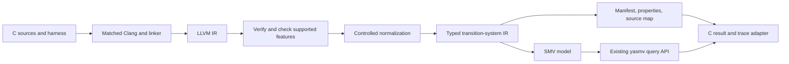

# llvm2smv implementation plan

Status: M0–M4 implemented on 2026-09-27, following code review at
`84738750`. The current [frontend contract](../llvm2smv/README.md) disables
legacy SMV generation and provides verified IR inventory and rejection
diagnostics. M1 adds the internal typed model foundation; M2 adds admitted scalar execution.
M3 adds the controlled scalar C safety workflow. M4 adds bounded addressable
memory with explicit coverage obligations. M5 and later milestones remain proposed. The review findings
describe the pre-M0 implementation.

The agreed scope is sequential C with integers, arrays, pointers, calls, and
bounded memory. Deliver a usable scalar verifier first, then extend the same
execution model to memory and interprocedural verification. Floating point,
threads, and unrestricted operating-system interaction are later projects.

### M0 delivery and validation

The implementation is on `feat/llvm2smv-m0`, based on master `5db88f11`.
The executable now verifies IR, inventories the selected direct call closure,
and emits structured rejection diagnostics. The legacy writer is excluded from
the binary. No execution feature is enabled yet, so all translation requests
fail without creating or modifying an SMV file. `--capabilities` reports this
explicitly; `--analyze` emits the inventory with an unsupported result.

Configure requires LLVM 18 and matching Clang, opt, and llvm-link versions.
Core-only configuration performs no LLVM discovery. Build helpers, distribution
entries, and the dedicated `make llvm-test` gate have been updated.

Validation used GCC 13.3.0 and LLVM/Clang 18.1.3 on Linux/aarch64:

* All 19 frontend and configure-contract tests passed, including output-file
  preservation, malformed/invalid IR, call closure, source locations, and tools.
* A fresh LLVM frontend build and the same tests passed outside the source tree.
* A fresh core-only in-source build passed, followed by native reachability and
  disabled-LLVM-target smoke checks.
* The optimized LLVM-enabled repository build and full `make test` gate passed.
* All 19 frontend tests passed under AddressSanitizer and UndefinedBehaviorSanitizer
  with leak detection enabled. This sanitizer run covers the frontend, not the
  full core regression suite.
* Translator distribution contents, helper shell syntax, documentation links,
  and `git diff --check` passed.

### M1 delivery and validation

The [typed model foundation](../llvm2smv/MODEL_FORMAT.md) supplies immutable,
checked expressions; Boolean, 1–64-bit word, enum, and flat array types; stable
symbol identities; simultaneous guarded steps; and explicit initialization and
frame behavior. The writer preserves exact constants and emits explicit widths.
Unwritten persistent variables are frozen, while choices remain fresh each step.
Properties are definitions and metadata, never model invariants.

Deterministic bundles contain SMV, source-key maps, properties, provenance, and a
SHA-256 manifest covering all payload files. The internal publisher invokes
native model validation and uses Linux atomic no-replace directory publication.
It rejects digest errors, invalid models, UNKNOWN, checker failures, and timeouts.
No existing output is replaced, including in a concurrent publication race.

Native trace replay exposed an existing bug: untyped decoded constants used the
global word width and crashed replay of narrower variables. Replay and semantic
valuations now explicitly type scalar and array-element constants. A core query
regression covers mixed widths, continuation, and a tampered array value.

Validation on the same LLVM 18.1.3 / Linux/aarch64 baseline:

* The 19 frontend/configuration contracts and C++ typed-model self-tests passed.
* All 14 writer/publication integration tests passed against native yasmv,
  covering arithmetic and Boolean operators, signed/unsigned boundaries and
  casts, sequential/simultaneous state updates, arrays, choices, framing,
  properties, identifier collisions, deterministic bundles, and output failures.
* The typed-model self-tests and the same 14 integration tests passed with the
  model generator built under AddressSanitizer/UndefinedBehaviorSanitizer and
  leak detection. The native checker was the optimized build.
* The new mixed-width trace replay regression passed.
* A clean frontend build outside the source tree passed the same tests against
  the built native checker. Distribution contents and whitespace checks passed.
* All core test targets passed. The aggregate `make test` run stopped at an
  existing workbench completion/event race: `result.json` can become visible
  before its result event is appended. The failing test and full workbench
  group passed on rerun; the remaining workflow, analysis, and session targets
  passed separately. No workbench code was changed.

### M2 scalar execution

The [scalar model contract](../llvm2smv/SCALAR_MODEL.md) describes the admitted
LLVM 18 subset and the validated publisher. `--emit-scalar-bundle` creates an
unpublished candidate; `tools/llvm2smv_translate.py` validates and atomically
publishes it. Legacy direct `-o` output remains disabled, and inventory reports
remain separate from scalar admission.

Execution uses one active instruction location, simultaneous incoming PHIs,
explicit branch/switch edges, and stable normal/error exits. Scalar globals and
promotable locals support sequential C examples. Preflight checks precede the
versioned mem2reg normalization, followed by verification and a second check.
The controlled compile helper disables finite-loop assumptions.

The lowering implements 1–64-bit integers, signed/unsigned operations, casts,
comparisons, select, freeze, and admitted poison/overflow flags. Poison travels
with registers and scalar memory; unused/unselected poison does not immediately
fail. UB at admitted use sites enters an error sink. Unsupported calls, pointers,
aggregates, `undef`, progress assumptions, metadata, and attributes fail closed.
Constant multiplier bounds and powers-of-two shifts avoid unnecessary arithmetic
circuits while preserving widths and poison behavior.

Native acceptance checks cover the counter's return at ten and forbidden 99,
conditional stores, nested loops, intentional nontermination, PHI swaps, switch,
poison uses, casts, and integer boundaries. Exhaustive two-bit operand pairs
(and selected one-bit cases) are compared with an independent Python integer
interpreter. The larger nested-loop check at depth 250 hit its 90-second process
limit; regression checks now cover the observed normal-exit depth plus stuttering
steps. This is bounded evidence, and deeper expensive queries remain inconclusive
when resource limits are reached.

Validation on LLVM 18.1.3 / Linux/aarch64:

* All 19 frontend/configuration tests, typed-model C++ self-tests, and 14 native
  writer/publication tests passed.
* The full scalar suite passed normally and under ASan/UBSan with leak detection.
  Subsequent global-name collision and debug-intrinsic admission regressions
  passed, with the final changes also checked against counter execution,
  admission failures, poison behavior, and publication under sanitizers.
* A clean out-of-tree frontend build passed the frontend/configuration and C++
  checks; its final binary passed counter, debug-intrinsic, and global-name
  regressions. Distribution contents and whitespace checks passed.

### M3 scalar C safety workflow

Implemented on `feat/llvm2smv-m3`, based on merged master `c5977c80`.
The [C workflow guide](../llvm2smv/C_WORKFLOW.md) documents the supported entry,
hooks, compilation policy, source evidence, and result scopes.

The frontend checks the full syntactic acyclic call closure, promotes scalar
locals, and inlines by cloning blocks and joining returns with PHIs. It preserves
instruction execution, including unused immediate-UB sites, and explicitly
instruments noundef call boundaries. This deliberately avoids LLVM's ordinary
clone-and-prune inlining: a regression demonstrated that it folded away an
unused division by zero. Source locations retain nested inline call chains.

Checked verifier declarations implement assertions, error, assumptions, and
fresh scalar nondeterminism. Assertions enter persistent per-site failure
locations and export properties, never invariants. False assumptions enter
ASSUMED_OUT; progress discharges that exclusion without treating it as normal
termination. A separate replayed universal-exclusion proof distinguishes
no-admitted-execution from ordinary success.

`tools/verify-c.py` compiles one or more C units with matched LLVM 18 tools and
controlled assertion headers, links bitcode, validates and atomically publishes
the model, checks initialization, and runs bounded safety, optional induction,
or universal progress. The compiled preprocessed snapshots, expanded-header
content hashes, flags, tool identities, and hook policy are retained in bundle
provenance. Checks use a private copy of the digest-validated model.

Safety violations require native trace replay and include basic C instruction
locations, inline chains, global bits/poison, and chosen nondeterministic values.
Progress evidence is independently replayed through validate-progress. Missing
local-variable reconstruction is explicit. No result claims independently
certified translation or complete ISO C undefined-behavior detection. Depth,
state, and time limits never become an unbounded proof.

Validation on LLVM/Clang 18.1.3, GCC 13.3.0, Linux/aarch64:

* All 19 frontend/configuration contracts, typed-model C++ self-tests, 14 native
  writer/publication tests, and 14 scalar semantic regressions passed across
  batches. No core source was changed.
* All 11 new C workflow tests passed normally and with the translator built
  under ASan/UBSan and leak detection. Coverage includes nested calls, looped
  calls, multiple returns, unused immediate UB, noundef, fresh choices,
  assertion sites, multi-unit source chains, assumption exclusion, induction,
  time/state limits, output preservation, and tampered evidence.
* Native C harness execution independently reproduced the safe/unsafe examples
  with the model witness input. Native model traces and progress evidence were
  replayed before accepting their conclusions.
* A fresh out-of-tree frontend build passed C++ self-tests and four workflow
  groups covering calls, UB boundaries, assumptions, and source evidence.
  Frontend distribution contents, Python syntax, and whitespace checks passed.

### M4 bounded addressable memory

Continued after M3 commit `64b6e9bc`. The [memory contract](../llvm2smv/MEMORY_MODEL.md)
specifies DataLayout-driven arrays/structures, byte aliases, global and stack
objects, aggregate operations, opaque pointer provenance, and memory intrinsics.
Acyclic direct calls now accept and return data pointers. Return instrumentation
expires local objects, and allocation generations prevent stale-pointer reuse.

Byte storage carries initialized and poison bit masks plus ordered pointer
fragments when needed. Typed accesses, partial writes, relocations, overlapping
memmove, equal-address memcpy, memset, and whole-object lifetime markers use the
same storage. Reading uninitialized required bits is an explicitly strict
diagnostic policy, stronger than general LLVM undef semantics. Claimed access
alignment must be guaranteed by object alignment and offset.

Static object storage is bounded and oversized candidates are rejected. Runtime
allocation-generation exhaustion and unmodeled pointer operations enter separate
coverage sinks. The C driver checks those obligations alongside safety, replays
witnesses, and distinguishes `resource_bound_reached` and `unsupported`. Memory
policy, bounds, layouts, and byte-state source projections accompany artifacts.

Initial encodings timed out on small dynamic-pointer and copy fixtures. Disjoint
byte selection, statically known addresses, provably bounded internal GEP
arithmetic, and fixed-point propagation of constant model slots reduced that
cost without narrowing C integers or pruning instruction execution. Larger
models can still exhaust checker resources; no timeout is a successful check.

Validation on LLVM/Clang 18.1.3 and Linux/aarch64:

* All 19 frontend/configuration contracts, C++ model self-tests, and 15 native
  writer/publication regressions passed. The writer gate includes changing
  dependencies and unconstrained state under constant propagation.
* All 19 memory groups passed across a full suite and final focused runs. They
  cover partial writes, bit masks, aggregate layout, dynamic indices, pointer
  selection and call-return PHIs, provenance copies, memset, lifetime errors,
  generation bounds, offset coverage, full-width GEP wrap, and fail-closed
  admission. The C alias fixture and its failing variant agree with independent
  native C execution; model witnesses replay successfully.
* The memory groups also passed under ASan/UBSan with leak detection, across the
  initial full suite and focused final regressions. The native checker remained
  the optimized build. No core source was changed.
* A clean out-of-tree frontend build passed model self-tests, C alias checks,
  admission, and pointer-call boundaries. Distribution contents, Python syntax,
  documentation links, and whitespace checks passed.
* All 14 existing scalar semantic groups and 11 C-workflow groups passed using
  a fixed translator binary. An earlier scalar run overlapped a frontend relink
  and failed to launch the executable; that run was discarded and rerun.

The next milestone is M5: bounded general call frames and recursion. Heap
allocation and general numeric pointer representations remain later work.

## 1. Findings in the current codebase

The existing translator is a syntax-generation prototype. Extending its opcode
switches alone will not make it a correct C verifier.

| Area | Current behavior | Required change |
| --- | --- | --- |
| [Module pass](../llvm2smv/src/llvm2smv_pass.cc) | Finds `main` but never uses that selection; translates every defined function into simultaneously active state. Each PC goes directly from entry to exit. | Select an entry and its reachable call graph; implement sequential execution and call/return. |
| Control flow | Branches, returns, switches, and PHIs have no execution semantics. | Explicit instruction locations, successor edges, and simultaneous PHI updates. |
| [Expressions](../llvm2smv/src/expr_translator.cc) | Arithmetic, loads, and stores produce unconditional next-state assignments. Dependent instructions therefore read old temporaries. | Separate pure expression lowering from guarded execution steps. |
| Memory | Loads return the pointer expression; stores assign to the pointer variable. Global addresses enter the unknown-constant fallback and become zero. | Distinguish SSA values, addresses, objects, and memory contents. |
| Globals | Only null initializers are initialized; nonzero constants are unconstrained. | Translate complete supported initializers, including relocations and aggregate initialization. |
| Integer semantics | All integer values are unsigned; signed/unsigned comparisons, division/remainder, and right shifts collapse together. | Preserve bit widths and select semantics by instruction/predicate. |
| Failure handling | Unknown types/constants become integers/zero; unsupported instructions can disappear without a diagnostic. | Reject unsupported semantics before publishing output. |
| Names | Raw names can collide across functions or violate SMV syntax; counters and output timestamps impede reproducibility. | Stable, collision-free identifiers and deterministic output. |
| [Writer](../llvm2smv/src/smv_writer.cc) | Untyped constants, incomplete expression support, and ad hoc parentheses; width 32 is printed as bare `uint`, even when `--word-width` changes the default. | Typed AST, exact constants, explicit widths, structural precedence, and validated output. |
| Build/tests | Autotools works with local LLVM 18.1.3. Test coverage is translation smoke only. Discovery names stop at LLVM 15; scripts invoke unversioned tools. `build.sh` calls a nonexistent `deps` target; distribution lists lowercase `design.md`. | Supported toolchain contract, matched tools, proper regression gates, and distribution fixes. |
| Documentation | The old design requires bounded loops, translates sequential C assignments as simultaneous updates, and suggests assertions as model invariants. | Replace these assumptions with the execution and property contracts below. |

The core already provides the required verification entry points: typed model
validation, bounded/shortest reachability, safety checking and k-induction,
trace replay, explanations, process isolation, immutable workbench revisions,
and universal eventuality. Reuse these interfaces instead of adding a second
solver or a separate property engine. See
[query contracts](QUERY_AND_TRACE_CONTRACTS.md),
[safety analysis](STRONGER_ANALYSIS.md), and
[progress checking](PROGRESS_CHECKING.md).

### Focused checks performed

These were small experiments with the existing binaries, not a full rebuild or
regression run. Temporary files were outside the repository.

* Compiled the repository counter example using local Clang 18.1.3 at `-O0`;
  translation returned success with two unknown-constant warnings.
* The generated SMV passed `validate-model`, but `reach counter = 99` succeeded
  at depth 1. Its initial `tmp_4` was unconstrained and equal to 99, then assigned
  to `counter`. The C example starts at zero and stops at ten.
* A minimal `#inertial` variable initialized to 7, with no assignments anywhere,
  could change to 0 at the next step. The same model with `#frozen` could not.
  [Frame generation](../src/model/analyzer/analyzer.cc) visits tracked assignment
  targets, not every inertial declaration.
* `uint8` compared to an uncast literal under the default word width failed
  type checking. Explicit `(uint8)` casts worked. Constant typing must be part
  of expression lowering, not delegated to a global word-width setting.
* The two-step encoding in section 4 loaded successfully, reached `DONE` with
  `x = 1, y = 2` at depth 2, and could not reach `DONE` with `y != 2` through
  depth 4. This checks the proposed encoding pattern, not translator correctness.

These cases should become permanent semantic regressions.

## 2. Verification contract

The product verifies a specified C build and environment: source files, target
ABI, compilation flags, entry harness, external-function models, and bounds.
It does not claim to decide arbitrary C programs.

The translator's correctness obligation is correspondence between supported
LLVM executions and generated model paths at observable boundaries. Extra
internal steps are allowed, but must preserve assertion failures, memory
effects, calls, normal termination, and infinite executions. Test both directions:
missing behaviors can produce false proofs; additional behaviors can produce
false counterexamples. State the relation explicitly for each lowering.

Use these result distinctions in the C-facing driver:

| Result | Meaning |
| --- | --- |
| Violation | A replay-validated assertion or modeled runtime failure in an admitted execution. |
| Holds through depth K | No violation within K model transitions; unbounded safety remains unknown. |
| Proven for the configured model | The existing backend established an unbounded result for the precise finite model and assumptions. |
| Resource bound reached | A modeled stack, heap, object, or allocation-identity capacity was exceeded; this is not a C bug or a proof of safety. |
| Unknown | Search, proof, time, or resource analysis was incomplete. |
| Unsupported/error | Translation or model validation failed; no verification conclusion. |

Always retain model-bound scope. To promote a finite-model proof to a claim
about the admitted C executions, also establish that artificial resource limits
cannot be reached and retain all environment assumptions. If resource coverage
is unknown, the C-level conclusion remains conditional/inconclusive. A real
violation before a bound is reached is still useful.

Loops remain graph cycles; no mandatory unrolling or iteration limit. Search
depth counts generated transitions, not C statements or loop iterations.
Recursion and storage require finite representations. Do not silently reduce
C integer widths to make verification cheaper.

Default semantic target: supported LLVM IR under a pinned toolchain, with
explicit runtime-error instrumentation. C-level guarantees additionally depend
on the frontend and harness. Arbitrarily optimized IR cannot recover source
assertions or undefined behavior already removed by compilation. Document the
supported C error checks; do not advertise complete ISO C undefined-behavior
detection from LLVM alone.

## 3. Compiler architecture



Keep the translator standalone and LLVM optional for core builds. Preserve
Autotools; there is no need for a build-system migration or a loaded pass plugin.
Replace the legacy `ModulePass` orchestration with an explicit translation
service returning `Expected<TranslationArtifact>` or an equivalent typed result.
Use LLVM's supported pass manager for normalization internally.

Proposed responsibilities under `llvm2smv/`:

| Component | Responsibility |
| --- | --- |
| `translation_options`, `diagnostics` | Entry, ABI, bounds, policy, structured unsupported-feature errors. |
| `module_analysis`, `normalization` | Verification, reachable functions, feature inventory, controlled preprocessing. |
| `names`, `source_map` | Stable IDs, debug provenance, symbol and instruction mappings. |
| `transition_system` | Typed state, initial values, guarded steps, simultaneous writes, events, and properties. |
| `cfg_lowering` | Locations, branches, switches, PHIs, exit/error locations. |
| `expr_translator`, `type_translator` | Typed pure expressions and precise integer semantics; no direct emission of transitions. |
| `memory_model`, `call_lowering` | Object layout, accesses, lifetimes, frames, calls, returns. |
| `runtime_models` | Explicit semantics for verifier hooks, library functions, and selected intrinsics. |
| `smv_writer` | Typed AST serialization for this repository's SMV dialect. |
| C driver and trace adapter | Build invocation, artifact identity, query delegation, and C-facing evidence. |

Start with LLVM/Clang 18, matching the installed and previously recorded local
baseline, rather than claiming compatibility with every LLVM 10+ release. This
is a project baseline, not a claim that LLVM 18 is the newest release. Add further
majors only with conformance testing. Match Clang, linker, opt, libraries, and
debug-info handling. Record target triple and DataLayout; reject unsupported or
ambiguous configurations rather than infer layout from the host.

Normalize only with a documented, versioned pass pipeline. Promote eligible
allocas to SSA and optionally split aggregates; preserve properties and debug
provenance. Handle `optnone` deliberately in the controlled frontend path.
Verify IR before and after normalization. Do not run general `-O2` as a substitute
for implementing semantics. Inspect semantic attributes, operand bundles,
address spaces, and intrinsics as well as opcodes.

Check the full syntactic call-graph closure, including instructions on branches
not known to be executable; do not assume an unsupported construct is harmless
without a separately justified elimination. Progress-related attributes such as
`mustprogress` and `willreturn` also need an explicit policy. A termination claim
about the source cannot ignore assumptions about termination already embedded
in its IR. Record the controlled frontend policy and reject unhandled attributes.

## 4. Execution and SMV encoding

Use one active program location, initially one location per executable LLVM
instruction. PHIs are a simultaneous bundle on the incoming edge. Debug-only
instructions create provenance, not execution. A later block-composition pass
may reduce steps after equivalence testing.

Each transition-system step contains a current-state guard, a simultaneous
write map, its successor location, source provenance, and optional error/event.
Expression translation cannot add independent `TRANS` clauses. A step writing
`x` and then a dependent `y` must either occupy two locations or substitute the
updated expression into `y` before composition.

For example, this sequential fragment is valid as two generated steps:

```smv
#word-width 8
MODULE main
#inertial
VAR pc : { L0, L1, DONE };
    x : uint8;
    y : uint8;
INIT pc = L0 && x = (uint8) 0 && y = (uint8) 0;
TRANS pc = L0 ?: x := x + (uint8) 1, pc := L1;
TRANS pc = L1 ?: y := x * (uint8) 2, pc := DONE;
TRANS pc = DONE ?: pc := DONE;
```

Both `x` and `y` then stop changing at `DONE`. This illustrates the target
encoding; it is not a current translator output.

Encoding requirements:

* Guard all writes and control transfers by the active location. Branch guards
  partition true/false; switch cases and the default are disjoint. Normal and
  error transitions also partition their conditions.
* Evaluate all incoming PHI expressions in the predecessor state and update
  the destination PHIs together. Test swaps, loop-carried values, self-edges,
  and multiple PHIs. Never evaluate PHIs as sequential assignments.
* Make every ordinary executing location advance, branch, return, or report a
  modeled error. Missing guards must not create accidental stuttering.
* Use `#inertial` guarded assignments for variables with writers. Preserve every
  other persistent component explicitly, or declare truly immutable variables
  `#frozen`. Do not rely on an unwritten inertial variable to retain its value.
* Treat never-initialized internal storage separately from language-level
  nondeterminism. Irrelevant temporary bits may have canonical initial values
  only when execution/definedness guarantees prohibit observing them.
* Emit comma-separated assignment bundles. The current analyzer tracks guarded
  assignments and requires mutual exclusion without assuming reachability.
  Guards must therefore be disjoint even in unreachable valuations.
* Start with scalar memory cells or complete array updates. Do not rely on
  indexed assignments to supply correct framing for all untouched array cells;
  establish that separately with backend tests.
* Normal exit and error/bound locations have explicit stable behavior. Normal
  exit sets a termination predicate and retains the return value.

Nondeterministic choices are ordinary changing state variables, sampled into
the destination register on the relevant step. `#input` means a compilation-time
binding in this checker and is not suitable for repeated nondeterministic calls.
Do not enumerate entire integer domains as SMV set literals.

## 5. Integer and undefined-value semantics

Represent scalar integers as fixed-width bit patterns; choose signed views at
the operation boundary. Implement add/subtract/multiply, bitwise operations,
signed and unsigned comparison/division/remainder, both right shifts, left
shift, `select`, and integer conversions. Preserve flags and failure conditions.
Use LLVM `APInt` throughout constant handling and an explicitly typed SMV
representation; initially admit only backend-tested widths through 64 bits.
Reject larger widths until a multiword lowering exists.

LLVM integer types do not carry C signedness; signed operations and predicates
specify the interpretation. PHIs select by incoming edge, and casts and shift
opcodes have distinct behavior. These are the semantic references for the
lowering contract, not opportunities for signedness heuristics.
[LLVM 18 language reference](https://releases.llvm.org/18.1.8/docs/LangRef.html).

Explicitly test `i1` arithmetic and conversions. Mapping every `i1` operation to
Boolean syntax is insufficient: truncation to one bit differs from a nonzero
test, and sign-extending true differs from zero-extending true. Signed shifts
and signed remainder need independent boundary tests against the core compiler.

Use a value-plus-definedness representation where required. Distinguish
per-use `undef` choices, poison propagation, immediate UB, and `freeze`, which
stabilizes its chosen value. A poison-producing instruction is not automatically
an immediately failing C operation; unused or unselected poison needs correct
treatment. Model flags such as `nsw`, `nuw`, and `exact`, division errors, invalid
shifts, and relevant use-site obligations. Reject any unsupported combination.
[LLVM UB manual](https://llvm.org/docs/UndefinedBehavior.html).

Keep an optional stricter diagnostic policy, such as reporting uninitialized
reads, distinct from exact LLVM semantics. Frontend-instrumented C checks may
report at a different point than LLVM poison becomes observable; label that
policy and include it in the artifact identity. Do not erase flags or turn
undefined behavior into arbitrary zero values.

## 6. Memory, pointers, and calls

The memory model is the largest semantic work package. Start with globals and
promotable locals, then extend to finite addressable objects. Use one canonical
byte representation for addressable storage, with scalar promotion only where
aliasing analysis establishes equivalence.

Each object needs identity, size, alignment, storage duration, liveness,
writability, data, and definedness metadata. Lay out arrays, structures, unions,
padding, and bit-field storage according to the admitted target ABI. Represent
data pointers by object identity and byte offset, with enough allocation identity
to distinguish stale pointers after reuse; null is explicit. Do not expose this
internal pointer encoding as a C numerical address.

Use DataLayout and instruction-specific access types. Modern opaque pointers
do not supply an element type to recover through `PointerType`.
[LLVM opaque-pointer guide](https://llvm.org/docs/OpaquePointers.html).
GEP computes an address, not a load; its offsets and `inbounds` obligations need
their own lowering. One-past pointers may exist without being dereferenceable.
[LLVM GEP guide](https://llvm.org/docs/GetElementPtr.html).

Required memory behavior:

* Globals, stack objects, constant data, aggregate/zero initializers, string
  constants, and pointer relocations; unresolved external objects require a
  declaration in the harness/environment contract.
* Loads/stores of the admitted widths, byte ordering, alignment, overlapping
  accesses, aliasing, access bounds, read-only storage, and use-after-lifetime.
  Access and offset checks themselves must not wrap silently.
* Pointer values stored in memory, including copies through aggregates and
  memory intrinsics. Preserve provenance/definedness metadata through these
  copies; arbitrary byte edits must not fabricate valid pointers accidentally.
* `memcpy`, `memmove`, and `memset`, with correct overlap policy and explicit
  lengths. Zero lengths and boundary cases require tests.
* Dynamic allocas/VLAs and heap allocation only with declared capacity.
  Repeated allocas in loops obey their actual allocation lifetime, not one
  automatically reused cell per static instruction.
* A pinned pointer-comparison policy and supported address spaces. Initially
  reject arbitrary pointer/integer casts, forged addresses, nonintegral pointer
  targets, and unmodeled pointer operations. Add them only with a concrete ABI
  and provenance design.

For calls, inline acyclic direct callees first. This gives a useful early C
subset while retaining a single execution stream. Then introduce bounded
frames: stack pointer, return continuation, argument slots, local registers and
objects, return destination, and lifetimes. Preserve caller locals across nested
calls; function statics remain shared globals. Handle ABI lowering such as
aggregate return/argument conventions deliberately.

Recursion and mutual recursion use the same frames and produce a separate
bound event at capacity. A module instance per function is not sufficient:
SMV module composition does not implement sequential call/return.

Bounded heap models cover `malloc`, `calloc`, `realloc`, and `free`, including
allocation failure, copying, invalid/double free, and stale pointers. Separate
real modeled allocator failure from verification capacity exhaustion. A finite
allocation-generation counter must never wrap and revive a stale pointer;
generation exhaustion is another explicit model bound unless a sound finite
reuse abstraction has been established. State whether a budget limits live
storage, total allocations, or both.

Closed-world function pointers can later dispatch over known type-compatible
targets. Unknown targets and external side effects require explicit models.
No unknown call may become a no-op or a nondeterministic return without its
memory effects and assumptions being specified.

## 7. Properties, assumptions, and evidence

Provide a small verifier header and a runtime-model registry for assertion,
assumption, nondeterministic scalar return, and explicit error hooks. Support
common verifier-hook spellings through checked adapters. Translate supported
standard `assert` failure paths too, but require assertions enabled in the
controlled build and record macros such as `NDEBUG`.

Assertions create error transitions or persistent failure flags. Export
properties such as `!assertion_failed` separately in the artifact. Never emit
`INVAR assertion_condition` to check an assertion: that would remove violating
executions from the model. Keep failure kind and source site available for
individual properties and trace presentation.

Assumptions restrict the execution at their call site, not every model state.
Do not implement a false assumption merely by disabling the PC assignment,
since inertia would create an infinite stutter. Define excluded executions
explicitly: use an `ASSUMED_OUT` terminal location, distinguish it from normal
termination, and discharge it only when checking progress of admitted paths.
Report vacuity/no-admitted-execution separately. LLVM's own `llvm.assume`
semantics must not be silently equated with a harness assumption hook.

Check termination with the existing progress engine, using the generated
normal-exit predicate and the documented assumption policy. Error and bound
locations are not successful termination. Retain the backend's lack of fairness
and explicit-state scalability limits. Artificial internal stutter must not
manufacture nontermination.

Emit an artifact bundle:

* `model.smv`: deterministic standalone model with a stable `main` root.
* `manifest.json`: schema version; hashes of source, IR, dependencies, generated
  model, runtime models, and toolchain; target, flags, entry, passes, semantic
  policies, bounds, feature inventory, and generated-state statistics.
* `properties.json`: named safety properties, resource-coverage obligations,
  and termination goals consumable by the existing query/workbench interfaces.
* `source-map.json`: generated symbols/locations/clauses to LLVM instructions,
  C file/line/column, inline call chain, source variables, and assertion IDs.
* Optional normalized IR for debugging and reproducibility.

Collect source mappings during lowering, rather than trying to reconstruct
them from emitted SMV. Preserve LLVM debug locations and variable-location
information where available; optimized-out or ambiguous C variables must be
shown as unavailable. [LLVM debug information](https://llvm.org/docs/SourceLevelDebugging.html).

Join the sidecar with existing SMV source-occurrence IDs after loading, using
generated spans/IDs and exact hashes. Keep the core trace-v1 format for model
replay and store the C projection alongside it. Display C locations, call stack,
visible local values, memory changes, chosen nondeterministic inputs, and failure
sites. Validate the model trace before presenting a C-level counterexample.
SMV replay validates a model path; it does not independently certify translation.

Add executable replay for defined, supported executions by recording inputs and
using a deterministic harness. Compare observable behavior with native C/LLVM
execution where applicable. Preserve distinctions between replay divergence,
translation error, instrumentation-detected UB, and a verified model witness.

## 8. User workflow and integration

Keep the existing IR command shape, with proposed additions for entry, bounds,
manifest output, and capability inspection. Add a small C-facing driver, proposed
as `tools/verify-c.py`, rather than making the core checker depend on Clang.
Example target workflow (not implemented commands):

```sh
python3 tools/verify-c.py program.c --entry main --check assertions \
  --stack-depth 8 --heap-bytes 256 --heap-objects 8 --output investigation
```

The driver compiles and links translation units, invokes the translator,
validates the generated model, checks initial-state consistency, and delegates
queries through the existing isolated runner. It preserves compile/link flags,
include paths, defines, dependency hashes, harnesses, and library models.
Later accept `compile_commands.json` with explicit link-unit selection; it does
not by itself describe a complete executable or link command.

Entry defaults to a defined `main`; fail if absent rather than selecting an
arbitrary function. Custom function entries require typed argument and memory
harnesses. `argc`/`argv` need a bounded environment model, not an arbitrary
unconstrained pointer. Startup constructors/destructors and exit behavior must
be modeled or rejected explicitly.

Publish bundles atomically only after successful translation and validation.
Keep diagnostics off model stdout. Include failure location, instruction/type,
and suggested supported alternative in structured errors. Cancellation or a
translation budget must not leave a usable-looking partial model.

Integrate C bundles as immutable workbench revisions with named properties and
source views. Include all translation dependencies in cache invalidation and
verify sidecar/model identity before loading saved evidence. Existing raw SMV
workflows and native query contracts remain usable.

## 9. Implementation milestones and acceptance gates

Each milestone should be delivered as reviewable changes with executable
semantic tests. Later feature support must not weaken rejection behavior.

| Milestone | Deliverables | Acceptance gate |
| --- | --- | --- |
| **M0 — supported contract and build** | LLVM 18 baseline, matched tool discovery, feature inventory, structured diagnostics, corrected docs/distribution, regression harness. | Unsupported reachable instructions/types/attributes fail with nonzero status and no published model; clean LLVM-enabled and core-only builds work. |
| **M1 — typed model foundation** | Translation-system IR, symbol allocator, typed writer, exact widths/constants, explicit initialization/framing, deterministic bundle identity. | Generated fixtures pass parser/type/guard checks; identifier collisions, mixed widths, 64-bit constants, immutable state, and atomic output tests pass. |
| **M2 — scalar execution** | CFG/branches/switch/return, PHI bundles, integer semantics and admitted poison rules, scalar globals, promoted locals, controlled normalization. | Counter ends at ten and cannot reach 99; sequential dependencies, conditional stores, nested loops, PHI swaps, signed/unsigned boundaries, and intentional infinite loops match an independent small interpreter. |
| **M3 — useful C safety workflow** | Acyclic direct-call inlining, assertion/assumption/nondet hooks, C driver, basic source map, property export, trace replay, honest result scopes. | Safe and unsafe C examples run end to end; failures point to C lines; false assumptions do not produce false termination failures; bounds/timeouts never become proofs. This is the first usable scalar release. |
| **M4 — addressable memory** | Object layout, arrays/structs, pointers/GEP, globals/stack objects, byte accesses, aggregate operations and initialization, memory intrinsics, definedness. | Aliasing, partial writes, boundaries, alignment, pointer-containing structures, overlapping copies, and lifetime errors agree with specified semantics and independent fixtures. |
| **M5 — general call stack** | Bounded frames, direct nested/recursive calls, ABI arguments/results, stack lifetimes, dynamic allocation on stack, explicit stack-bound obligations. | Recursive and mutually recursive fixtures preserve callers; escaping stack pointers fail appropriately; insufficient depth gives a resource result, not safety. |
| **M6 — bounded heap and call targets** | Allocator models, liveness/provenance through reuse, bounded indirect dispatch, explicit external contracts. | Heap data structures, allocation failure, realloc, stale pointers, double free, generation limits, and function-pointer dispatch pass; unmodeled effects remain rejected. |
| **M7 — C evidence and workbench** | Full manifest/schema validation, C trace projection, executable replay, bundle import, source navigation, termination workflow. | Saved counterexamples replay after restart; changed build inputs invalidate identity; scalar, pointer, recursive, and heap examples expose accurate C evidence and scoped results. |
| **M8 — performance and release** | Measured state reduction, optional block composition, memory scalarization improvements, backend bottleneck fixes where justified, documented coverage. | Optimized and reference encodings agree; full local regression and sanitizer gates pass; published benchmark records include outcome, scope, state bits, load time, SAT work, and query time. |

Dependencies are M0 → M1 → M2 → M3; M4 builds on that foundation, M5 needs M4,
and M6 needs M5. Provenance and result contracts begin in M1/M3 even though full
UI delivery is M7. Measure performance throughout, but keep a simple reference
encoding available before M8 optimizations.

The first concrete implementation batch should be M0/M1 plus one M2 vertical
slice: translate the counter faithfully, reject every feature outside that
slice, and check its expected and forbidden states with yasmv. Do not treat
successful file generation as completion of that slice.

## 10. Testing strategy

Add dedicated translator unit tests and a process suite under
`tests/test_llvm2smv.py`, with checked-in C and hand-authored LLVM IR fixtures.
Handwritten IR is necessary to exercise semantics that Clang may optimize away.
Use matched tools and temporary build directories; tests must fail on compile,
translation, validation, or unexpected query results.

Test layers:

1. **Writer/backend conformance:** Boolean versus one-bit integers, explicit
   casts, signed operations, literals, arrays, frames, terminal states, and
   disjoint guards. Fix demonstrated core defects before depending on them.
2. **Small semantic oracles:** exhaust small integer domains and compare complete
   transition relations against a separate interpreter/reference implementation.
   Use boundary/random cases at 16/32/64 bits. APInt is useful for arithmetic;
   do not share the translator's lowering code with the oracle.
3. **End-to-end C:** safe/unsafe pairs, return values, final memory, assertion
   sites, nondeterministic sequences, calls, pointers, resource exhaustion, and
   termination/nontermination. Check forbidden behaviors as well as expected ones.
4. **LLVM edge cases:** poison on selected/unselected paths, `freeze`, per-use
   undefined values, wrap/exact flags, `i1`, PHI cycles, intrinsics, global
   constants, unreachable instructions, attributes, and unsupported features.
5. **Evidence and failure handling:** independent model replay, C harness replay,
   tampering, stale identities, malformed IR, cancelled jobs, exhausted budgets,
   invalid initial states, deterministic output, and no partial artifacts.
6. **Metamorphic/performance:** compare unnormalized/normalized inputs where the
   contract permits, reference/optimized encodings, and renamed/reordered input
   symbols. Track growth with CFG size, memory capacity, and recursion depth.

Integrate a dedicated LLVM test target into the existing local `make test` gate
when LLVM is enabled. Keep core-only testing independent. The repository's
current CI intentionally runs two core smoke checks; preserve that policy and
make full LLVM and sanitizer checks explicit local pre-commit gates. A small
LLVM CI smoke job can be considered separately rather than assumed in this plan.

## 11. Risks and deferred scope

The main risks are memory/provenance correctness, undefined values, backend
expression compatibility, and state-space growth. Generic C arithmetic creates
large SAT encodings; the current progress checker enumerates concrete states,
so realistic integer programs can exceed its budgets quickly.

Guard validation currently tests pairs of writers. A global instruction PC can
make this quadratic in program size. Benchmark early; a core optimization may
recognize provably disjoint equality guards on the same PC, with the existing
SAT check as fallback. Never disable guard checking to load generated models.

Control state growth through liveness, provably private-object promotion,
constant folding, inactive-frame canonicalization, and property-aware slicing.
For the latter, preserve failures, resource coverage, and termination; a safety
slice is not automatically valid for progress. Block composition must preserve
sequential dependencies and infinite paths. Any abstraction must declare its
soundness direction and require counterexample validation/refinement.

The initial complete scoped release does not include general floating point,
vectors, threads/atomics, signals, asynchronous volatile devices, inline assembly,
exceptions, `setjmp`/`longjmp`, unrestricted varargs, full libc/POSIX, or arbitrary
integer-address manipulation. Reject these explicitly unless a narrow tested
model exists. Follow-on projects are exact floating-point lowering, a defined
concurrency memory model and scheduler, broader library/environment models,
and abstraction/refinement for larger programs. These require separate semantic
contracts rather than additional opcode fallbacks.

The scoped release is complete when admitted sequential C programs have precise
finite execution models, unsupported programs fail explicitly, bounds and
assumptions remain visible in conclusions, and users can inspect and replay
C-level evidence through the existing checker workflow.
