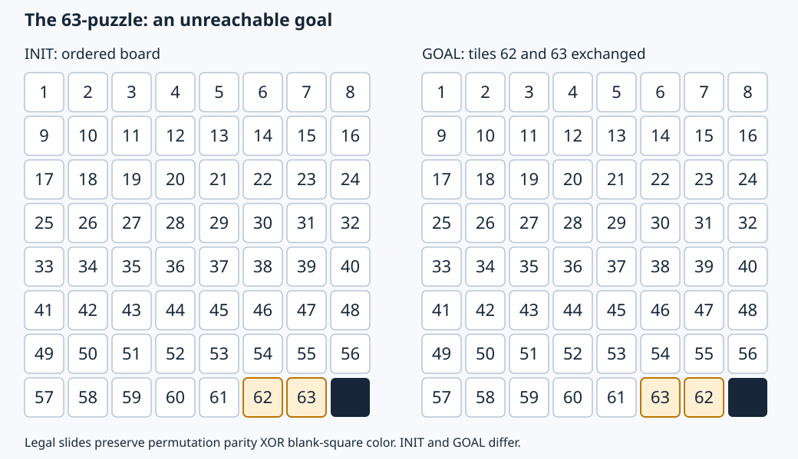

# The 63-puzzle: a large unreachable goal

An 8×8 version of the classic unsolvable 15-puzzle. Start with the numbered
tiles in order and the blank at bottom right. The target exchanges 62 and 63
and keeps every other tile, including the blank, in place.



[The generated SMV model](puzzle-63.smv) has 64 six-bit cells (384 board bits),
a four-valued move variable, 2,016 pairwise distinctness constraints, 64 legal
move guards, and 224 directed adjacent-swap commands. Cells are inertial.
Each command moves one nonzero tile into the blank; all other cells retain
their values. There is no idle move, artificial history, dummy state padding,
or supplied parity lemma. All valid board configurations have legal moves.

The reachable board component contains `64! / 2`, approximately
`6.344346609 × 10^88`, configurations. This count excludes the move variable.
The labels fit exactly in six bits; pairwise distinctness therefore says that
the board contains every label 0–63 exactly once.

## Why GOAL is unreachable

Johnson and Story's 1879 *Notes on the “15” Puzzle*, parts I and II, establish
the parity obstruction and the two components for rectangular sliding puzzles.
A modern research account with the original references is Karpman and Roldán,
[*Parity Property of Hexagonal Sliding Puzzles*, introduction, pp. 2–3](https://arxiv.org/pdf/2201.00919).

For this encoding, define the mathematical invariant

```
chi(board) = parity(permutation of all 64 labels, including 0)
             XOR ((blank_row + blank_column) mod 2)
```

Every adjacent slide swaps two labels and changes the blank's checkerboard
color, so both terms flip and chi stays fixed. The initial board has chi=1.
The goal has chi=0: its two numbered tiles were exchanged while its blank
stayed put. Thus no path reaches GOAL. This is our external mathematical
argument; the model contains no expression or constraint for chi.

## Why plain k-induction fails for every k

Let G be the goal board. Let A be G after sliding its blank LEFT; let B be A
after sliding its blank UP. All three are valid boards in the goal's parity
component. There are legal moves

```
A --UP--> B --DOWN--> A --RIGHT--> G
```

Both A and B satisfy `!GOAL`. For any k>=1, alternate A and B for exactly k
states, ending at A, then enter G. Start at A when k is odd and at B when k is
even. Set each state's move variable to the next slide; the final state's move
can be any legal move. This satisfies the induction step's transition relation
and all k preceding copies of `!GOAL`, then violates the property at step k.
It never needs INIT, which is absent from the step obligation.

Consequently the step is SAT for **every finite k**. This is a constructive
all-k argument, not an extrapolation from a few failed solver runs. Adding a
suitable auxiliary invariant, such as chi=1, could make induction succeed;
the claim concerns plain k-induction on `!GOAL`, as currently implemented.

## What was checked

`check.py` uses its own grid-coordinate slide evaluator. On the 2×2 instance
it exhausts all 24 permutations and four move choices: 48 legal successors
match the SMV transition relation exactly, and 48 boundary moves are rejected.
A separate breadth-first search finds 12 reachable boards and excludes GOAL.
It also checks generated 8×8 induction-step paths at k=1,2,3,4,8,16,63,64,127,
and 1024; the argument above covers arbitrary k.

The large model has a satisfiable initial state and a one-slide reachable
control target whose trace passed fresh replay. Native k-induction step
assignments for k=1,2,4 were checked against the independent slide evaluator:
all boards are permutations, all transitions are legal, and only the last
board is GOAL. The 2×2 instance also returned a verified interpolation proof,
with fresh initial-containment, transition-closure, and target-exclusion checks.

## Recorded large-model run

The run used the binary/model hashes in [the summary](results/summary.json),
seed 0, and fresh checker processes. Controls and induction probes had a
30-second cooperative wall budget. Unbounded interpolation had 120 seconds;
the outer process deadline was 140 seconds. Time includes model validation,
compilation, search, and evidence construction. Peak RSS is per-child Linux
`wait4` memory. The separate one-slide replay is outside its search timing.

| Query | Result | Process seconds | Peak MiB |
| --- | --- | ---: | ---: |
| initial | satisfiable | 3.487 | 382.6 |
| one-slide | reachable | 4.047 | 383.4 |
| induction-1 | holds_bounded; step SATISFIABLE | 5.851 | 384.0 |
| induction-2 | holds_bounded; step SATISFIABLE | 7.473 | 383.3 |
| induction-4 | holds_bounded; step SATISFIABLE | 11.767 | 692.2 |
| interpolation | UNKNOWN / deadline | 121.667 | 2286.9 |

**The large run did not prove unreachability.** It returned UNKNOWN at the
cooperative deadline, with no invariant or trace. It reached suffix horizon
3, attempted 9 image queries, made 5 enlargements and 3 restarts,
and recorded 11,229,513 cumulative resolution proof nodes. The peak
reached-circuit arena size was 6,143 nodes; this was not a verified invariant.
The 1,425 native solver calls include model guard checks (the initial-state
control already uses 1,393 calls), so they are not 1,425 image queries.

The independent parity proof establishes the answer. Interpolation currently
proves the small control but does not scale to this large instance within the
recorded budget. The result demonstrates a useful limitation, not an
interpolation success claim.

The large run completed concrete negative checks at depths 0–3. The separate
2×2 control proved unreachability in 9.943 seconds of reported query time,
using 26 image queries and suffix horizon 6. Its invariant passed all three
fresh-solver obligations.

## Reproduce

From a built repository:

```sh
python3 examples/sliding-puzzle-experiment/generate.py --side 8 \
  --output examples/sliding-puzzle-experiment/puzzle-63.smv
python3 examples/sliding-puzzle-experiment/check.py
python3 examples/sliding-puzzle-experiment/run.py --wall-ms 120000
```

The runner writes named request/result JSON files and `results/summary.json`.
The small verified proof is in `results/small-control.json`. A direct native
request for the large experiment is:

```json
{
  "version": 1,
  "model": "examples/sliding-puzzle-experiment/puzzle-63.smv",
  "query": {
    "operation": "reach",
    "strategy": "interpolation",
    "target": "GOAL",
    "limits": {"wall_ms": 120000}
  }
}
```

Run it with `YASMV_HOME="$PWD" ./yasmv --quiet --query-file request.json`.
Exit code 3 with `status: "unknown"` means incomplete search, not a proof.
